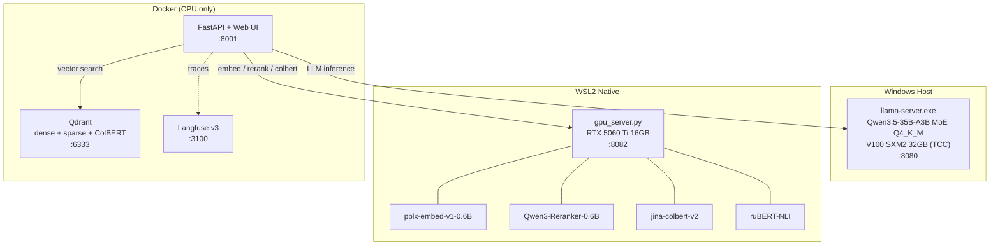
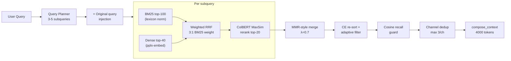
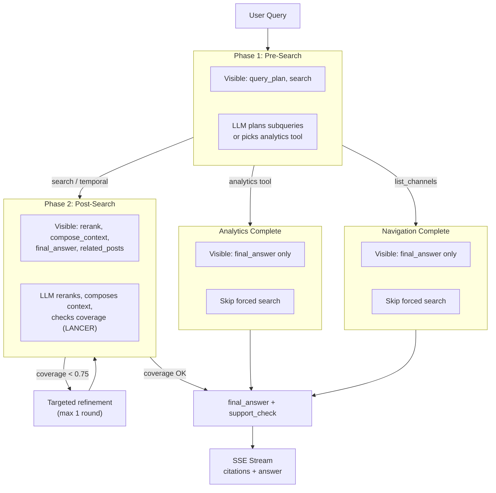

# rag_app — Self-Hosted RAG with Agentic ReAct Pipeline

> Most RAG portfolios show a LangChain demo. This project shows:
> 1. A custom end-to-end pipeline that **wins on a scoped LlamaIndex benchmark by +0.30 factual** on identical data and model
> 2. An evaluation framework with **57 runs, published judge artifacts, a broader 120Q independent judge pass**, and NLI-audited faithfulness
> 3. **39 ablation experiments** with honest reporting of what didn't work
>
> Self-hosted on two GPUs. No managed APIs. No frameworks.

        

Broader independent pass note: `RUN-009` on **120 reviewed questions** scored **0.898 factual** on **105 answerable** items with **95% CI [0.860, 0.931]**, **1.718 / 2 useful** with **95% CI [1.658, 1.776]**, **0.886 evidence support** on the **65 retrieval-evidence** slice, and **15/15 correct refusals** via `GPT-5.4 Pro` packet review.

Published baseline note: latest 36Q baseline is **0.803 raw** on the original dataset and **0.858 corrected** after auditing 7 overly narrow open-ended labels in `eval_golden_v2_fixed.json`.

---

## What it does

User asks a question about AI/ML news. ReAct agent plans sub-queries, runs hybrid retrieval (BM25 + dense + ColBERT) over 13K documents from 36 Russian-language Telegram channels, filters with cross-encoder + cosine recall guard, produces a grounded answer with citations via SSE streaming.

```
Query → query_plan → multi-query search (BM25+Dense → RRF → ColBERT) → MMR-style merge → CE re-sort + adaptive filter → compose_context → answer
```

15 LLM tools with phase-based dynamic visibility. Analytics tools (entity tracking, trend digests, channel expertise) short-circuit the search path when appropriate.

<!-- TODO: GIF of live SSE-streaming response (10-15 sec) -->
<!-- TODO: place demo.gif here -->

<details>
<summary><b>Example: real query trace</b> (from eval RUN-008)</summary>

```
User: "Кого Financial Times назвала человеком года в 2025?"
→ query_plan: 3 subqueries (k=10, fusion=rrf)                    3.7s
→ search: 28 docs retrieved (hybrid BM25+dense, 3 subqueries)    2.5s
→ rerank: CE scores [6.6, 5.2, 3.5, 2.5, 2.4] → 5 docs kept    1.9s
→ compose_context: 5 citations from 3 channels, coverage 0.70    0.002s
→ final_answer: 845 chars with inline [1][2][3] citations
Total: 31.7s (LLM inference ~25s = 84%, retrieval+rerank ~8s)

Answer: "Financial Times назвала «Человеком года» в 2025 году Дженсена Хуанга,
основателя и генерального директора NVIDIA [1][2]. Издание отметило ключевую
роль Хуанга в трансформации полупроводниковой индустрии..."
Sources: techsparks, ai_machinelearning_big_data, data_secrets
```

</details>

**Why 13K docs, not millions?** Small corpora are harder for retrieval than they look: there is no redundancy to compensate for weak search. If the relevant document is one of three, not one of thousands, precision matters more. The Telegram domain (mixed languages, emoji, slang, forwards, code snippets) is also messier than clean Wikipedia/arXiv text, and there are no ready-made benchmarks for it. This repo focuses on measured retrieval quality in that domain, not on unmeasured scale claims.

---

## Architecture



V100 in TCC mode poisons NVML in WSL2 — Docker GPU unavailable. All GPU workloads run natively. See [decision log](docs/architecture/11-decisions/decision-log.md).

---

## Eval Results

**Judge methodology**: published 36Q baseline artifacts use Claude Opus 4.6 as the primary judge, with manual calibration on hard cases and internal cross-checking against GPT-5.4 on disputed examples. The broader 120Q `RUN-009` pass below was reviewed independently via `GPT-5.4 Pro` in 12 packetized judge batches. Granular scale: factual 0.0-1.0 (step 0.1), useful 0.0-2.0 (step 0.1). Independent NLI audit via ruBERT is used for claim-level faithfulness analysis.

**Broader independent judge pass** (120 Qs `golden_v3`, [`RUN-009`](experiments/runs/RUN-009/results.yaml)):

| Metric | Value | Details |
|--------|-------|---------|
| **Factual correctness** | **0.898** | 105 answerable questions, independent `GPT-5.4 Pro` judge pass |
| **Usefulness** | **1.718 / 2** | 120 total questions, including refusals |
| **Evidence support** | **0.886** | 65 retrieval-evidence questions |
| **Retrieval sufficiency** | **0.958** | 65 retrieval-evidence questions |
| **Correct refusal** | **15 / 15** | refusal + adversarial slice |
| **Useful on answerable only** | **1.749 / 2** | 105 answerable questions |
| **Useful on refusal slice** | **1.507 / 2** | correct but sometimes overly terse refusal UX |
| **High-confidence answerable items** | **85 / 105** | factual `>= 0.9` |

This 120Q pass is a **broader generalization check**, not a drop-in replacement for the 36Q published baseline below. It includes more navigation, refusal, adversarial, edge, and exact-lookup items, so the denominators and mix are different.

Bootstrap CI for `RUN-009` via [`scripts/compute_confidence.py`](scripts/compute_confidence.py) and [`confidence_intervals.json`](experiments/runs/RUN-009/confidence_intervals.json): factual **0.898** with **95% CI [0.860, 0.931]**, useful **1.720** with **95% CI [1.658, 1.776]**, evidence support **0.886** with **95% CI [0.843, 0.923]**, retrieval sufficiency **0.959** with **95% CI [0.917, 0.991]**, correct refusal **1.000** with Wilson **95% CI [0.796, 1.000]**.

**Published baseline metrics** (36 Qs `golden_v2`, [latest run](experiments/runs/RUN-008/results.yaml)):

| Metric | Value | Details |
|--------|-------|---------|
| **Factual correctness** | **0.858 corrected** | 95% CI **[0.792, 0.917]**, n=36, after dataset audit of 7 open-ended labels; raw latest score on original set: **0.803** |
| **Usefulness** | **1.71 / 2** | 95% CI **[1.606, 1.803]**, n=36 |
| **Key Tool Accuracy** | **1.000** | 36/36 correct tool selection |
| **Faithfulness** | **0.91 adjudicated** | 17 retrieval Qs, 171 claims audited, **0 actual hallucinations after manual review of NLI false positives** ([analysis](experiments/legacy/reports/nli_faithfulness_analysis_20260401.md)) |
| **Retrieval R@5** | **0.900** | 120 natural-language queries, 6 categories |
| **Correct refusal** | **3/3** | Agent correctly refuses out-of-scope queries |
| **Mean latency** | **~30s** | LLM inference 84% (self-hosted Qwen3.5-35B on V100), retrieval ~2.5s, CE rerank ~2s. With managed API: ~6-8s estimated |

Bootstrap confidence via [`scripts/compute_confidence.py`](scripts/compute_confidence.py): retrieval factual **0.888** (95% CI [0.782, 0.965], n=17), analytics factual **0.793** (95% CI [0.679, 0.893], n=14). These intervals are intentionally wide at `n=36`; `RUN-009` now provides a broader 120Q pass with its own CI artifact.

### Why standard proxy metrics fail (and why we still implement them)

We compute BERTScore F1, SummaC, Precision@5, MRR, nDCG@5 on every eval run ([SPEC-RAG-22](docs/specifications/completed/SPEC-RAG-22-comprehensive-eval-metrics.md)). Finding: **they systematically underestimate pipeline quality** on Russian-language agent outputs.

| Proxy metric | Value | LLM Judge | Gap |
|-------------|:---:|:---:|-----|
| BERTScore F1 | 0.52 | Factual **0.858 corrected** | Can't distinguish refusal from answer — semantic similarity ≠ factual correctness |
| SummaC faithfulness | 0.37 | **0.91 adjudicated** | Misses cross-lingual paraphrases ("Хуанг (Nvidia)" ≠ "гендиректор NVIDIA") |
| Precision@5 | 0.10 | acceptable_set_hit 0.47 | Agent cites 5-8 docs, many relevant but not in narrow expected set |

19 raw NLI contradictions manually reviewed → **0 actual hallucinations** (12 ruBERT false positives on Russian paraphrases, 5 wrong-doc matches, 2 borderline). [Full analysis](experiments/legacy/reports/nli_faithfulness_analysis_20260401.md).

**Conclusion**: LLM judge remains the only reliable scoring method for our domain. Automatic metrics serve as diagnostic signals. We implement them to demonstrate the gap — consistent with recent literature on RAG evaluation limitations. Details: [R26](docs/research/reports/R26-deep-comprehensive-rag-eval-metrics.md), [robustness data](experiments/legacy/robustness/).

### Robustness ([Cao et al. 2025](docs/progress/experiment_log.md#методология-наша-vs-cao-et-al-2025-arxiv2505-21870) adapted)

Bypass pipeline: direct Qdrant + LLM, controlled k and ordering. 151 answers scored ([raw data](experiments/legacy/robustness/ndr_rsr_ror_raw_20260402-082135.json)).

| Metric | BERTScore (proxy) | Claude Judge (final) | Finding |
|--------|:-:|:-:|---------|
| **NDR** | 0.818 | **0.963** (26/27) | BERTScore underestimated by 0.145 |
| **RSR** | 0.706 | **0.941** (16/17) | BERTScore showed false violations |
| **ROR** | 0.974 | **0.959** | Roughly correct |
| **Composite** | 0.826 | **0.954** | |

**BERTScore F1 failed as a robustness proxy**: semantic similarity doesn't capture factual correctness — a "confident refusal" scores high similarity to the expected answer. Claude judge is required for final numbers. [Judge scores](experiments/legacy/robustness/judge_ndr_rsr_ror_final.json).

Retrieval adds **+0.53** absolute factual improvement (k=0: 0.10, k=20: 0.63). RSR monotonicity confirmed: k=3 (0.52) < k=5 (0.59) < k=10 (0.60) < k=20 (0.63).

57 eval runs across development. Full [experiment log](docs/progress/experiment_log.md) with per-question analysis.

### Custom vs LlamaIndex Benchmark

Built the same pipeline in LlamaIndex (best-effort) and measured against our custom implementation.
4 pipelines, same LLM, same data, same questions. [Full spec](docs/specifications/completed/SPEC-RAG-29-framework-comparison-benchmark.md). Research: [R27](docs/research/reports/R27-framework-benchmark-methodology.md).

**Agent E2E** (17 questions, judge: Claude Opus 4.6):

| Pipeline | Factual | Usefulness | Grounding | Latency |
|----------|:---:|:---:|:---:|:---:|
| Naive (dense + LLM) | 0.55 | 1.04 | 0.28 | ~4s |
| LlamaIndex stock | 0.51 | 1.13 | 0.46 | ~9s |
| LlamaIndex maxed (weighted RRF + CE) | 0.54 | 1.21 | 0.48 | ~11s |
| **Custom pipeline** | **0.84** | **1.77** | **0.88** | **~30s** |

On this scoped retrieval-evidence benchmark, custom wins by **+0.30 factual**, **+0.56 usefulness**, **+0.40 grounding** vs best framework config.

**Retrieval-only** (100 auto-generated queries — exact text fragments from posts):

| Pipeline | Recall@1 | Recall@5 | MRR | Latency |
|----------|:---:|:---:|:---:|:---:|
| Naive (dense only) | 0.820 | 0.920 | 0.861 | 0.1s |
| LlamaIndex stock | 0.820 | 0.920 | 0.861 | 0.1s |
| LlamaIndex maxed | 0.880 | 0.940 | 0.907 | 1.4s |
| **Custom (RRF + ColBERT)** | **0.939** | **0.949** | **0.944** | **0.2s** |

Custom wins clearly: **+12% Recall@1**, **+8% MRR** vs LlamaIndex maxed. ColBERT token-level matching shines on exact term queries (LLM, MoE, SSM).

**Retrieval-only** (100 hand-crafted natural-language queries):

| Pipeline | Recall@1 | Recall@5 | MRR | Latency |
|----------|:---:|:---:|:---:|:---:|
| Naive (dense only) | 0.730 | 0.940 | 0.825 | 0.1s |
| LlamaIndex stock | 0.730 | 0.940 | 0.825 | 0.1s |
| LlamaIndex maxed | 0.780 | 0.980 | 0.865 | 1.4s |
| **Custom (RRF + ColBERT)** | **0.780** | **0.970** | **0.866** | **0.2s** |

On natural-language queries the retrieval gap narrows — dense embedding already captures semantics well. ColBERT ≈ cross-encoder here. The real differentiation comes from the agent layer (query planning, LANCER, specialized tools), not retrieval tuning alone.

**Key insights** (applicable beyond this project):
- **Framework defaults add zero value**: LlamaIndex stock = naive on both datasets. Default hybrid fusion doesn't help without tuning
- **Agent layer is the differentiator, not retrieval tuning**: multi-query planning + LANCER coverage + specialized tools = main gain source. li_maxed reranker gave only +0.03 factual over stock
- **Grounding requires architecture, not prompting**: 0.88 vs 0.48 grounding comes from `compose_context` → `final_answer` citation pipeline, not from asking the LLM to "cite sources"
- **Custom 7x faster** on retrieval (direct HTTP vs framework abstraction), ~70 vs ~12 transitive dependencies

Full per-question breakdown in [judge_scores.md](experiments/legacy/benchmarks/judge_scores.md). Agent answers: [custom](experiments/legacy/benchmarks/agent_answers.json), [naive + LI](experiments/legacy/benchmarks/agent_naive_listock.json), [LI-maxed](experiments/legacy/benchmarks/agent_limaxed.json). Retrieval: [auto-generated](experiments/legacy/benchmarks/retrieval_auto_generated.json), [calibration](experiments/legacy/benchmarks/retrieval_calibration.json).

### Retrieval Ablation Study (39+ experiments)

Systematic 5-day study: parameter sweep, diagnosis, new retrieval tracks, orchestration improvements. Full results: [ablation_study.md](docs/progress/ablation_study.md), artifacts: [experiments/](experiments/).

**Progress**: R@5 0.833 → **0.900** (+8%), factual 0.842 → **0.858 corrected**, 8 formal experiment runs (RUN-001 through RUN-008).

| Phase | Experiments | Key result |
|-------|:-:|-----------|
| **Parameter sweep** | 24 | no-prefix +5.8% R@5, dense 20→40 +3.4%, ColBERT critical (−10% without) |
| **Diagnosis** | — | CE sigmoid bug fixed, stage attribution (semantic gap > truncation) |
| **New tracks** | 10 | Sparse lexicon norm +0.009 R@1. PRF, HyDE, normalize-all rejected |
| **Orchestration** | 3 traces | MMR merge, CE re-sort, adaptive filter, planner language fix |
| **Validation** (RUN-001) | 1 | Full pipeline R@5 = Retrieval-only (0.900), **context quality better** (judge 6:1:8) |
| **Post-protocol** (RUN-004–008) | 5 | Channel dedup 2→3 (adopted), cosine recall guard (adopted), dual scoring (rejected), negative intent fix |

**Answer comparison** (15 queries, both contexts → Qwen3.5, Claude judge): full pipeline produced better LLM answers in 6/15, worse in 1/15, tie in 8/15. Subqueries find additional relevant documents; CE re-sort puts best docs first.

**Experiment protocol** developed after two config-drift bugs wasted compute: spec-before-run, config parity checks, structured artifacts, early checkpoints. [Protocol](experiments/PROTOCOL.md).

### What didn't work (with evidence)

All rejected with measured evidence. Details in [experiment log](docs/progress/experiment_log.md#протестировано-и-отклонено-с-evidence).

| Technique | Result | Why rejected |
|-----------|--------|--------------|
| Cosine MMR | recall 0.70 → 0.11 | Re-promotes attractor documents |
| Dense re-score after RRF | recall 0.33 → 0.15 | Erases BM25 contribution |
| PCA whitening 1024→512 | recall 0.70 → 0.56 | Too aggressive dimensionality cut |
| DBSF fusion | 0.72 vs RRF 0.73 | RRF slightly better (ablation phase 1) |
| Dense+BM25 normalize-all | R@5 −4.2% | Synonyms in dense query dilute embeddings (ablation R1) |
| BM25 PRF expansion | R@5 −4.2% | Top terms from initial hits = noise (ablation R5) |
| HyDE pseudo-document | No improvement | Hypothetical doc doesn't help on hard subset (ablation D2) |
| Funnel expansion (RRF/ColBERT limits) | 0% change | Problem is semantic gap, not truncation (ablation A1-A3) |
| CE reranking after ColBERT | r@3: 0.97 → 0.94 | Degrades top-3, replaced with [CE filter](docs/architecture/11-decisions/decision-log.md) (DEC-0045) |
| Pipeline v2 (RRF→CE→ColBERT) | +0.02 r@2 only | Not worth complexity |
| BERTScore as robustness proxy | NDR off by 0.145 | Doesn't capture factual correctness |
| XLM-RoBERTa for Russian NLI | ent=0.006 on obvious pairs | ruBERT 150x better on Russian |
| Cosine-based coverage | 45% false refinements | Replaced with [LANCER-inspired lexical nugget coverage](docs/architecture/11-decisions/decision-log.md) (DEC-0044) |

---

## Key Components

| Component | Model / Tech | Size | Where |
|-----------|-------------|------|-------|
| **LLM** | Qwen3.5-35B-A3B MoE (3B active) | Q4_K_M | V100 via llama-server |
| **Embedding** | pplx-embed-v1-0.6B (1024-dim) | bf16 | RTX 5060 Ti |
| **Reranker** | Qwen3-Reranker-0.6B (CRAG-style filter) | fp16 | RTX 5060 Ti |
| **ColBERT** | jina-colbert-v2 (128-dim MaxSim) | fp16 | RTX 5060 Ti |
| **NLI** | rubert-base-cased-nli-threeway | fp16, 0.36 GB | RTX 5060 Ti |
| **Vector store** | Qdrant (dense + sparse BM25 + ColBERT) | — | Docker |
| **Observability** | Langfuse v3 (self-hosted) | — | Docker |
| **Data** | 36 Telegram channels, 13K docs ([channel selection](docs/research/reports/R09-telegram-channels-collection.md)) | Jul 2025 - Mar 2026 | Qdrant |

## Retrieval Pipeline



- **Multi-query**: LLM generates 3-5 sub-queries, each runs independent hybrid retrieval, then a **MMR-style score-proxy merge** balances relevance and diversity without extra embedding calls
- **Original query injection**: user query always in subqueries for BM25 keyword match
- **Sparse normalization** (R2): BM25 query normalized via lexicon (slang/aliases), dense query stays raw
- **LANCER-inspired lexical nugget coverage**: query_plan subqueries act as nuggets; refinement triggers on uncovered aspects using term-overlap coverage rather than a semantic verifier
- **CE re-sort + adaptive filter + cosine recall guard**: cross-encoder re-orders by relevance, gap detection (>2.0) + top-K guarantee (min 5). Cosine recall guard saves docs killed by CE but ranked high by bi-encoder — CE struggles with digest/bullet-list format ([sentence-transformers#2874](https://github.com/UKPLab/sentence-transformers/issues/2874)), cosine catches semantic relevance CE misses

## Agent Tools (15)

Phase-based dynamic visibility (max 5 visible), data-driven keyword routing from `datasets/tool_keywords.json`.

| Category | Tools |
|----------|-------|
| **Search** | `search`, `temporal_search`, `channel_search`, `cross_channel_compare`, `summarize_channel` |
| **Analytics** | `entity_tracker` (top/timeline/compare/co-occurrence), `arxiv_tracker` (top/lookup) |
| **Topics** | `hot_topics` (BERTopic weekly digest), `channel_expertise` (per-channel profiles) |
| **Planning** | `query_plan`, `list_channels` |
| **Enrichment** | `rerank`, `related_posts`, `compose_context` |
| **Synthesis** | `final_answer` |

### Agent ReAct Flow



---

## Observability

Self-hosted Langfuse v3. Every agent request produces a trace tree with per-span timing, token usage, and tool outputs.

<!-- TODO: screenshot of Langfuse trace tree with real query (replace ASCII below) -->
<!-- Langfuse UI: http://localhost:3100, pick a retrieval_evidence trace like q01 or q02 -->

```
agent_request (root)                          30.5s total
├── llm_step_1 → llm_chat_completion         1.7s  (1144 in → 38 out tokens)
├── tool:query_plan                           2.7s
├── llm_step_2 → llm_chat_completion         1.4s
├── tool:search → hybrid_retrieval            2.5s  (30 docs, 3 subqueries)
├── llm_step_3 → llm_chat_completion         11.0s
├── tool:rerank → CE filter                   2.1s  (scores: 9.4, 9.3, 9.1...)
├── tool:compose_context                      0.002s (10 citations, coverage 0.79)
├── llm_step_4_final → llm_chat_completion    8.0s  (7453 in → 305 out tokens)
├── tool:final_answer
└── tool[system]:evidence_support_check → hybrid_retrieval  0.4s
```

Rich output per span: hits_count, coverage, prompt_len, token usage. Error marking for failed tools. Root trace: plan, strategy, tokens, coverage, citations_count.

---

## Development Workflow

Built with AI coding agents (Claude Code, Codex) following a structured process:

```
Research (29 reports) → Specification (35 specs) → Implementation → Evaluation → Documentation
```

- **Research-driven**: every decision backed by deep research ([R00-R27](docs/research/reports/), [46 prompts](docs/research/prompts/))
- **Evaluation-first**: 57+ eval runs + 39 ablation experiments, every change measured against [golden dataset](datasets/eval_golden_v2.json) ([experiment log](docs/progress/experiment_log.md), [ablation study](docs/progress/ablation_study.md))
- **Specs before code**: concrete acceptance criteria, reviewed by Codex ([35 completed specs](docs/specifications/completed/))
- **Architecture docs**: mirror current codebase ([system overview](docs/architecture/04-system/overview.md), [flows](docs/architecture/05-flows/))
- **Decision log**: [45 ADR entries](docs/architecture/11-decisions/decision-log.md) documenting every choice and why

---

## How We Run It

Our hardware: V100 SXM2 32GB (LLM inference), RTX 5060 Ti 16GB (embedding + reranker + ColBERT), Docker Desktop (CPU services).

```bash
# 1. LLM on V100 (PowerShell)
llama-server.exe -m models/Qwen3.5-35B-A3B-Q4_K_M.gguf --jinja --reasoning-budget 0 -c 32768

# 2. Embedding + Reranker + ColBERT + NLI on RTX 5060 Ti (WSL2)
CUDA_VISIBLE_DEVICES=0 python scripts/gpu_server.py --with-nli

# 3. Infrastructure (Docker)
docker compose -f deploy/compose/compose.langfuse.yml up -d  # Langfuse
docker compose -f deploy/compose/compose.dev.yml up -d        # API + Qdrant

# Web UI: http://localhost:8001
# Langfuse: http://localhost:3100
```

## Project Structure

```
src/
  adapters/             Qdrant, LLM (llama-server), TEI, hybrid retriever
  api/                  FastAPI endpoints + SSE streaming
  services/             Agent service (decomposed), 15 tools, query planner
  services/agent/       State, coverage, executor, routing, formatting
  services/eval/        NLI faithfulness verification (eval-only)
  core/                 Settings, DI, observability (Langfuse)
scripts/                GPU server, evaluation, NLI, ingestion, calibration
docs/
  architecture/         Source of truth (45 decisions, flows, data model)
  research/             46 prompts + 29 reports (R00-R27) + audio transcripts
  specifications/       35 completed specs
  progress/             Project scope + experiment log (57 runs)
experiments/            Experiment protocol, baseline config, run artifacts (spec + data + results)
benchmarks/             Framework comparison (LlamaIndex vs custom, 4 pipelines)
datasets/               Golden dataset (36 Qs), calibration (100 Qs), prompts, entity dictionary
deploy/                 Docker compose (dev, langfuse, test, benchmark)
```

## Security Considerations

15 LLM tools with dynamic visibility create a non-trivial misuse surface. Current guards are intentionally basic: `SecurityManager` validates direct user input patterns, `refusal_policy` with deterministic trim blocks known out-of-scope cases, tool visibility is phase-gated (agent cannot call `final_answer` before search, cannot call `search` after analytics short-circuit), and rate limiting applies per-client backoff. This is a portfolio-grade safety story, not a mature adversarially-evaluated agent security stack yet. Formal adversarial eval for prompt injection, tool abuse, and retrieved-context attacks is still future work.

## What I'd do with more resources

**Fine-tuning the reranker** on domain-specific hard negatives. Qwen3-Reranker-0.6B struggles with digest/bullet-list format (CE=-5.8 on clearly relevant docs). LoRA fine-tuning on ~500 hard negative pairs from our eval logs — expected +3-7% on domain based on literature. ~1 hour on H100, ~$3 on cloud. The hard negatives already exist in our experiment artifacts.

**Production deployment**: failure mode handling (gpu_server crash → graceful degradation to dense-only), cost model per query, multi-user rate limiting beyond current middleware. The current architecture is a solid starting point for productionization, but failure-mode hardening and adversarial evaluation still need dedicated work.

**Scaling beyond the current corpus**: add news wire collections alongside Telegram and measure retrieval behavior under larger collection sizes. Main work: incremental reindex pipeline, Qdrant sharding config, stale document detection, and fresh latency benchmarks rather than extrapolation.

## License & Usage

Code: [Apache 2.0](LICENSE) — free to use, modify, and learn from.

This is a research/portfolio project, not a product. The methodology, experiment logs, ablation results, and decision rationale in `docs/` and `experiments/` are the main deliverable — the code is an implementation of that methodology. If you're building your own RAG system, the writeups are probably more valuable than copying the code: your domain and data will require different choices, and the point of this project is showing how to make those choices systematically.

Questions, discussions, and methodological critiques welcome via [Issues](../../issues).
