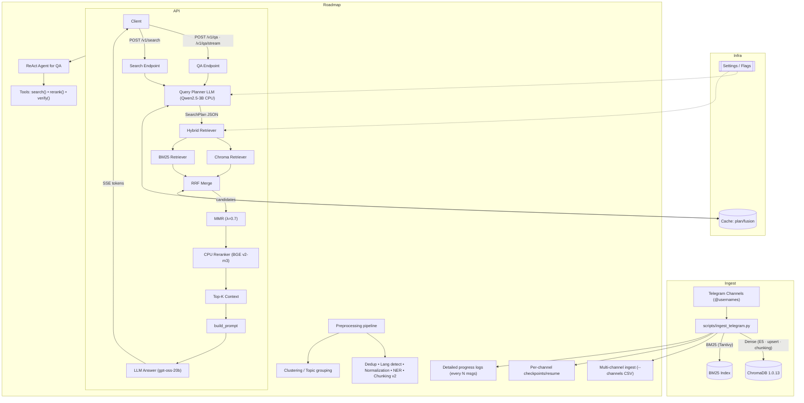

```mermaid
graph TD

%% Current (Done)
subgraph Ingest
  TG["Telegram Channels (@usernames)"] --> ING["scripts/ingest_telegram.py"]
  ING -->|"Dense (E5 · upsert · chunking)"| CHR[("ChromaDB 1.0.13")]
  ING -->|"BM25 (Tantivy)"| BM[("BM25 Index")]
end

subgraph API
  U[Client] -->|"POST /v1/qa · /v1/qa/stream"| QA["QA Endpoint"]
  U -->|"POST /v1/search"| SRCH["Search Endpoint"]

  QA --> PL["Query Planner LLM (Qwen2.5-3B CPU)"]
  SRCH --> PL
  PL -->|"SearchPlan JSON"| HYB["Hybrid Retriever"]
  HYB --> DENSE["Chroma Retriever"]
  HYB --> BMR["BM25 Retriever"]
  DENSE --> RRF["RRF Merge"]
  BMR --> RRF
  RRF -->|"candidates"| MMR["MMR (λ=0.7)"]
  MMR --> RER["CPU Reranker (BGE v2-m3)"]
  RER --> CTX["Top-K Context"]
  CTX --> PROMPT["build_prompt"]
  PROMPT --> LLM["LLM Answer (gpt-oss-20b)"]
  LLM -->|"SSE tokens"| U
end

subgraph Infra
  CCH[("Cache: plan/fusion")]
  CFG[["Settings / Flags"]]
  PL <--> CCH
  RRF <--> CCH
  CFG -.-> PL
  CFG -.-> HYB
end

%% Roadmap (Planned)
subgraph Roadmap
  MC["Multi-channel ingest (--channels CSV)"]
  CKP["Per-channel checkpoints/resume"]
  LOGS["Detailed progress logs (every N msgs)"]
  PRE["Preprocessing pipeline"]
  PRE_ITEMS["Dedup • Lang detect • Normalization • NER • Chunking v2"]
  CLUST["Clustering / Topic grouping"]
  REACT["ReAct Agent for QA"]
  TOOLS["Tools: search() • rerank() • verify()"]
  ING --> MC
  ING --> CKP
  ING --> LOGS
  PRE --> PRE_ITEMS
  PRE --> CLUST
  API --> REACT
  REACT --> TOOLS
end
```