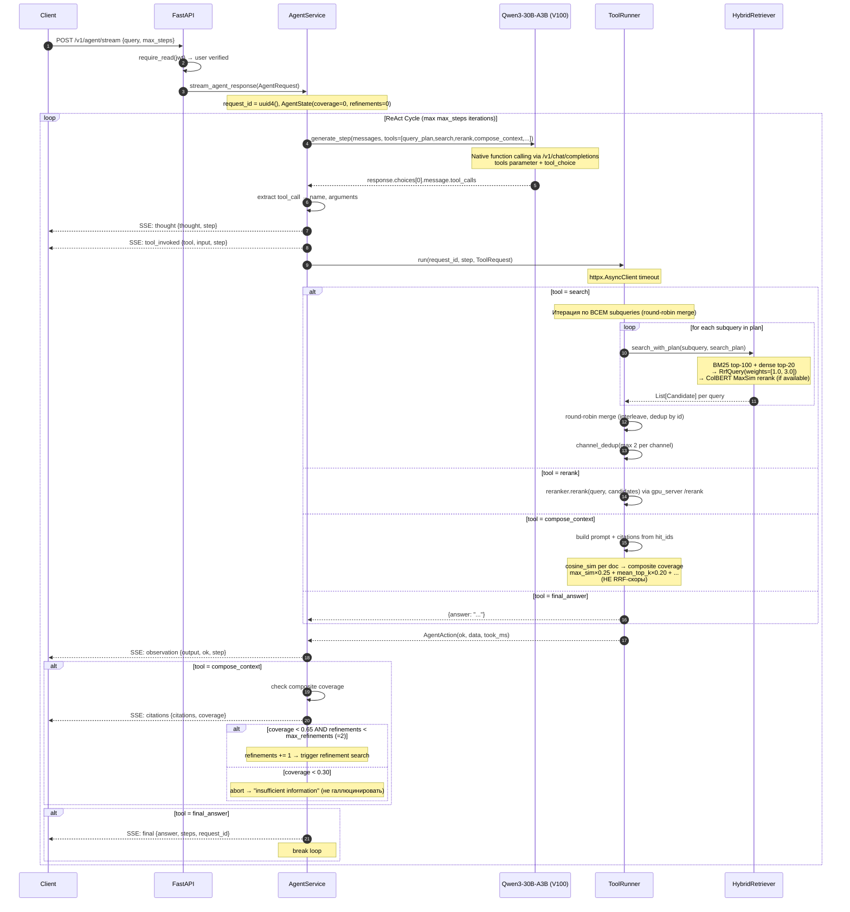
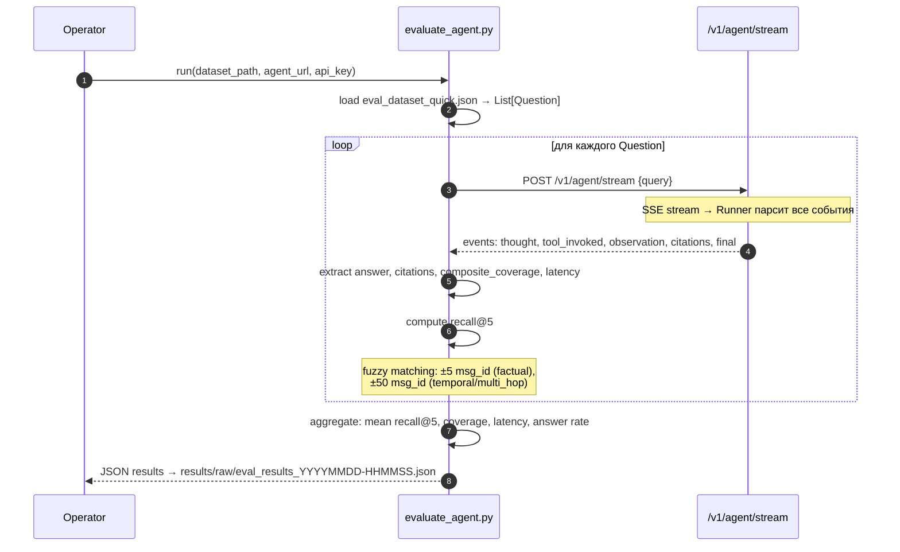
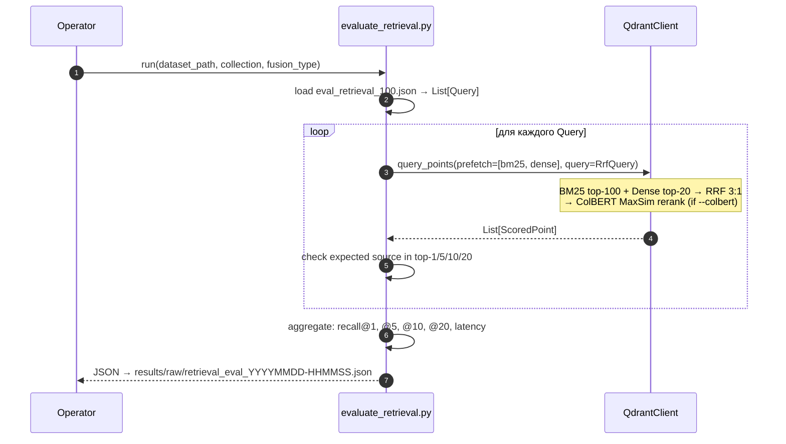

<!-- GENERATED FILE: do not edit by hand. Edit sources in docs/architecture/ and re-run build. -->

# rag_app Architecture

> **Назначение:** единый источник правды по архитектуре rag_app.
> **Правило:** если переписка в чате и этот документ расходятся — **верим документу**.

**Версия:** v0.2
**Обновлено:** 2026-03-16
**Статус:** Done — все 14 файлов обновлены по итогам R01–R06. Готово к написанию спецификаций.

---


---

## How-To: работа с архитектурным документом

### Источник истины

Модульные файлы в `docs/architecture/` — источник истины.
Все изменения вносятся только в модули.

### Структура модулей

```
docs/architecture/
  00-meta/        — заголовок, howto, tldr
  01-scope/       — границы системы, цели
  02-glossary/    — термины
  03-invariants/  — что должно быть истинно всегда
  04-system/      — обзор стека и компонентов
  05-flows/       — сценарии взаимодействия (FLOW-XX)
  06-api/         — API контракты
  07-data-model/  — схема данных
  08-security/    — безопасность
  09-observability/ — наблюдаемость
  10-open-questions/ — открытые вопросы
  11-decisions/   — лог решений (ADR-lite)
```

### Ritual обновления

После любого архитектурного изменения:
1. Правим нужный модуль (flows, invariants, data-model и т.п.)
2. Обновляем `decision-log.md` если принято новое решение
3. Если вопрос закрыт — убираем из `open-questions.md`

### Сборка в единый документ

Модули можно скомпилировать в единый `Architecture_ru.md` через скрипт сборки.
На текущий момент скрипт не реализован — читать модули по отдельности напрямую.
При необходимости: реализовать по образцу `vpn-server/archimade/build_arch.py` +
добавить `docs/architecture/build_order.json` с порядком файлов.

### Как работать с LLM

- Даём LLM конкретный модуль как target + релевантные файлы как контекст
- LLM возвращает **полную обновлённую версию модуля**
- Человек принимает решение, смотрит diff

### Язык и форматирование

- Основной текст — **русский**
- Якоря, идентификаторы — **латиницей**: `FLOW-xx`, `DEC-xxxx`, `OPEN-xx`
- Имена полей, статусы — **как в коде**: `coverage_threshold`, `citation_coverage`
- Mermaid диаграммы в стандартных fenced-блоках ` ```mermaid `
- Все модули начинаются с `##`, не `#` (зарезервирован для заголовка)


---

# Documentation Governance

> Свод правил ведения документации проекта. ОБЯЗАТЕЛЕН для всех агентов (Claude, Codex).
> Нарушение этих правил приводит к "свалке" — главной проблеме которую мы решаем.

---

## Принципы

1. **Каждый документ имеет ровно одно место** — если не знаешь куда положить, прочитай этот файл.
2. **architecture/ = зеркало кода** — всегда отражает текущее состояние. Устаревший docs/architecture хуже чем его отсутствие.
3. **research/ = неизменяемый архив** — отчёты НЕ редактируются post-factum. Новые findings = новый отчёт.
4. **specifications/ = мост между research и code** — spec описывает ЧТО делать, КАК, и ЗАЧЕМ.
5. **planning/ = операционные живые документы** — scope, playbook, планы внедрения. Обновляются при каждом значимом изменении.

---

## Структура docs/

```
docs/
├── architecture/           ← ИСТОЧНИК ПРАВДЫ: "что сделано и зачем"
│   ├── 00-meta/           (как пользоваться документацией, governance)
│   ├── 01-scope/          (scope проекта)
│   ├── 02-glossary/       (термины)
│   ├── 03-invariants/     (правила которые нельзя нарушать)
│   ├── 04-system/         (системная архитектура, диаграммы)
│   ├── 05-flows/          (потоки: ingest, agent, eval)
│   ├── 06-api/            (API контракты)
│   ├── 07-data-model/     (Qdrant schema, payloads, vectors)
│   ├── 08-security/       (auth, sanitization)
│   ├── 09-observability/  (logging, metrics)
│   ├── 10-open-questions/ (нерешённые вопросы)
│   └── 11-decisions/      (decision log — ADR)
│
├── research/               ← ИССЛЕДОВАНИЯ: "что изучили"
│   ├── prompts/            (промпты для Deep Research, пронумерованы)
│   └── reports/            (отчёты R01-R99, пронумерованы, неизменяемы)
│
├── specifications/         ← СПЕЦИФИКАЦИИ: "что планируем сделать"
│   ├── active/             (текущие и следующие specs)
│   └── completed/          (имплементированные — архив для reference)
│
└── planning/               ← ОПЕРАЦИОННЫЕ ДОКИ: "как идём к цели"
    ├── project_scope.md    (roadmap, фазы, метрики)
    ├── retrieval_improvement_playbook.md  (история экспериментов)
    └── [plan].md           (планы внедрения конкретных фич)
```

---

## Workflow: когда что создавать и обновлять

### 1. Research — новое исследование

**Когда**: появился вопрос требующий deep dive, сравнения подходов, выбора технологии.

**Действия**:
- Создать промпт: `docs/research/prompts/NN-topic-name.md` (следующий номер)
- Получить отчёт: `docs/research/reports/RNN-topic-name.md`
- Quick и Deep варианты: `RNN-quick-topic.md`, `RNN-deep-topic.md`
- Зафиксировать findings в `docs/planning/` (playbook или scope)

**Правила**:
- Номера промптов и отчётов последовательные, не пропускать
- Отчёты **неизменяемы** после создания (append clarification ОК, rewrite НЕТ)
- Промпты содержат полный контекст проекта (hardware, текущий pipeline, метрики)

### 2. Specification — решили внедрять

**Когда**: research завершён, решение принято, нужно описать ЧТО конкретно делать.

**Действия**:
- Создать spec: `docs/specifications/active/SPEC-RAG-NN-name.md`
- Spec содержит: цель, контекст (ссылки на reports), что менять, acceptance criteria
- После реализации: переместить в `docs/specifications/completed/`

**Правила**:
- Spec пишется ДО кода, не после
- Spec ссылается на конкретные research reports
- Acceptance criteria — конкретные (recall > X, latency < Y, тест Z проходит)

### 3. Implementation — пишем код

**Когда**: spec утверждён, начинается разработка.

**Действия**:
- Коммиты со ссылками на spec (в commit message или PR)
- Обновить `docs/planning/` с результатами (playbook, scope)

### 4. Documentation — обновляем architecture/

**Когда**: после каждого значимого изменения в коде (новая фича, смена архитектуры, новый компонент).

**Что обновлять** (чеклист):
- [ ] `04-system/overview.md` — если изменилась архитектура, компоненты, их связи
- [ ] `05-flows/` — если изменился flow (ingest, agent, eval)
- [ ] `07-data-model/` — если изменилась schema Qdrant, payloads, vectors
- [ ] `11-decisions/decision-log.md` — если принято архитектурное решение
- [ ] `06-api/` — если изменились API endpoints
- [ ] `03-invariants/` — если появились новые правила "нельзя нарушать"

**Правила**:
- architecture/ описывает ТЕКУЩЕЕ состояние, не историю
- Если что-то удалено из кода — удалить из docs (никаких "removed in v2" комментариев)
- Decision log — единственное место где фиксируется ПОЧЕМУ (исторический контекст)

---

## Правила именования

| Тип | Паттерн | Пример |
|-----|---------|--------|
| Research prompt | `NN-kebab-case.md` | `07-tool-router-architecture-prompt.md` |
| Research report | `RNN-kebab-case.md` | `R13-deep-tool-router-architecture.md` |
| Specification | `SPEC-RAG-NN-kebab-case.md` | `SPEC-RAG-11-adaptive-retrieval.md` |
| Architecture doc | `kebab-case.md` в соотв. папке | `05-flows/FLOW-02-agent.md` |
| Planning doc | `kebab-case.md` | `adaptive_retrieval_plan.md` |

---

## Что НЕ создавать

1. **Автогенерированные описания файлов** — код читается через MCP, не через markdown зеркало
2. **Дубликаты** — одна тема = один документ. Если есть в architecture, не повторять в planning
3. **Временные файлы** (plan.md, temp.md, notes.md) — либо в planning/ с нормальным именем, либо не создавать
4. **Pricing/cost analysis** — не часть технической документации
5. **Module-per-file docs** — docs/ai/modules/ был ошибкой, не повторять

---

## Ответственность агентов

### При КАЖДОМ коммите — проверить:
- Не создаю ли файл в неправильном месте?
- Нужно ли обновить architecture/?
- Нужно ли обновить planning/ (scope, playbook)?

### При создании нового файла — спросить себя:
- Это research? → `docs/research/`
- Это план что делать? → `docs/specifications/active/`
- Это описание текущего состояния? → `docs/architecture/`
- Это живой операционный документ? → `docs/planning/`
- Не подходит ни к чему? → **Не создавать. Обсудить с пользователем.**

### При рефакторинге/крупном изменении:
- Обновить `docs/architecture/04-system/overview.md`
- Добавить запись в `docs/architecture/11-decisions/decision-log.md`
- Обновить `docs/planning/project_scope.md` если затронуты фазы/метрики


---

## Scope

### Что такое rag_app

**rag_app** — FastAPI-платформа RAG + ReAct агент для поиска и агрегации новостей
из Telegram-каналов.

Пользователь задаёт вопрос на русском → ReAct агент с 5 LLM-инструментами ищет по
проиндексированным 36 Telegram-каналам (13K+ документов) → отвечает с цитатами через SSE стриминг.

**Целевой пользователь**: один пользователь (автор проекта) — для обучения и
демонстрации навыков в applied LLM/AI.

### Что входит в scope

- **Ingest**: загрузка Telegram-каналов → Qdrant (dense + sparse + ColBERT vectors)
- **Retrieval**: гибридный поиск (BM25+Dense → weighted RRF 3:1 → ColBERT MaxSim → cross-encoder rerank → channel dedup)
- **ReAct агент**: native function calling, 5 LLM tools, auto-refinement, grounding
- **API**: FastAPI с JWT auth, `/v1/agent/stream` (SSE), Web UI
- **Evaluation**: agent eval (через LLM) + retrieval eval (прямые Qdrant queries)

### Что НЕ входит в scope

- Multi-user / multi-tenant
- Горизонтальное масштабирование
- Production SLA / uptime guarantees
- Автоматическое переключение каналов / live-инgest

### Ключевые цели проекта

1. Рабочий end-to-end RAG агент на локальных LLM (self-hosted, no managed APIs)
2. Портфолио для Applied LLM Engineer позиций
3. Полный цикл: ingest → retrieval → agent → evaluation с tracked experiments
4. Adaptive retrieval — ключевое отличие от фреймворков (LlamaIndex/LangChain)


---

## Glossary

| Термин | Определение |
|--------|-------------|
| **ReAct** | Reasoning + Acting: цикл LLM (Thought → Action → Observation) для агентского поиска |
| **native function calling** | LLM вызывает tools через `tools` parameter в `/v1/chat/completions` (OpenAI-compatible), без regex-парсинга текста |
| **SSE** | Server-Sent Events: однонаправленный push от сервера к клиенту (EventSource) |
| **coverage** | Float 0–1: composite из 6 cosine-сигналов о достаточности контекста. Если < `coverage_threshold` → refinement. Вычисляется в `compose_context`, требует `with_vectors=True` в Qdrant запросе. |
| **coverage_threshold** | `0.65` — порог для запуска refinement (DEC-0019). Bias toward retrieval: false-negative → 66% галлюцинаций. |
| **composite coverage** | Weighted sum: `max_sim×0.25 + mean_top_k×0.20 + term_coverage×0.20 + doc_count_adequacy×0.15 + score_gap×0.15 + above_threshold_ratio×0.05`. Использует cosine similarity, НЕ RRF-скоры. |
| **refinement** | Дополнительный поисковый раунд при `coverage < coverage_threshold` |
| **max_refinements** | `2` — максимальное число refinement-раундов (DEC-0019) |
| **RRF** | Reciprocal Rank Fusion: `score(d) = Σ 1/(k+rank_i)`, k=60. Weighted RRF: BM25 weight=3, dense weight=1. |
| **ColBERT** | Contextualized Late Interaction over BERT: per-token vectors + MaxSim scoring. Фундаментально решает attractor document problem. |
| **MaxSim** | ColBERT scoring: для каждого query token — максимальное dot product с document tokens, затем сумма. |
| **jina-colbert-v2** | ColBERT модель (560M, 89 языков, 128-dim per token). Загружается в gpu_server.py с manual linear projection 1024→128. |
| **channel dedup** | Post-retrieval: max 2 документа из одного канала. Улучшает diversity, не recall. |
| **round-robin merge** | Multi-query result interleaving: для rank 0..N, чередуем результаты из каждого subquery. Сохраняет per-query ColBERT ranking. |
| **attractor document** | Документ с высоким cosine similarity к большинству запросов (из-за embedding anisotropy). ColBERT + weighted RRF решают проблему. |
| **BGE reranker** | bge-reranker-v2-m3: dedicated cross-encoder reranker. Logit gap 18 (vs 8 у старого bge-m3). Запускается на GPU (RTX 5060 Ti). |
| **HybridRetriever** | `src/adapters/search/hybrid_retriever.py`: BM25 top-100 + dense top-20 → weighted RRF (3:1) → ColBERT MaxSim rerank → channel dedup. Fallback на RRF-only если ColBERT недоступен. |
| **gpu_server.py** | `scripts/gpu_server.py`: HTTP-сервер (stdlib http.server + PyTorch cu128) с 3 моделями: Qwen3-Embedding-0.6B + bge-reranker-v2-m3 + jina-colbert-v2. Единый порт :8082. |
| **Qwen3-30B-A3B** | Основная LLM: MoE модель (30B total, 3B active params). GGUF Q4_K_M через llama-server на V100. Native function calling через `--jinja --reasoning-budget 0`. |
| **Qwen3-Embedding-0.6B** | Embedding модель (1024-dim). Лидер MTEB Multilingual / MIRACL Russian. Через gpu_server.py на RTX 5060 Ti. |
| **news_colbert** | Qdrant коллекция: 3 named vectors (dense 1024 + sparse BM25 + colbert 128-dim multi-vector), 13124 точки из 36 каналов. |
| **AgentService** | `src/services/agent_service.py`: единственный владелец ReAct цикла и SSE стриминга |
| **ToolRunner** | `src/services/tools/tool_runner.py`: реестр инструментов + единый запуск с timeout |
| **AgentState** | Внутреннее состояние одного запроса агента: coverage, refinement_count, search_count |
| **compose_context** | Инструмент: собирает контекст из hit_ids → prompt + citations + composite coverage |
| **verify** | Системный инструмент (не LLM tool): проверяет утверждения через допоиск в KB |
| **QueryPlannerService** | `src/services/query_planner_service.py`: LLM разбор запроса на sub-queries. Тот же V100 endpoint. |
| **SearchPlan** | Pydantic модель: subqueries из query planner |
| **lru_cache singleton** | Паттерн в `src/core/deps.py`: сервисы создаются один раз, кэшируются через `@lru_cache` |
| **GGUF** | Формат файлов для llama.cpp: квантованные LLM для CPU/GPU inference |
| **llama-server** | HTTP-сервер из llama.cpp (`llama-server.exe`), OpenAI-compatible API на V100. |
| **LlamaServerClient** | `src/adapters/llm/llama_server_client.py`: async HTTP-обёртка над llama-server (httpx.AsyncClient). |
| **Qdrant** | Vector database: named vectors (dense + sparse + ColBERT), нативный weighted RRF. |
| **evaluate_agent.py** | Agent eval скрипт: full pipeline через LLM, ~40с/запрос, recall@5 + coverage + latency. |
| **evaluate_retrieval.py** | Retrieval eval скрипт: прямые Qdrant queries без LLM, ~5с/запрос, recall@1/5/10/20. |


---

## Invariants (должно быть истинно всегда)

### INV-01: SSE Event Contract

Публичный контракт событий `/v1/agent/stream` **не изменяется без явной версии API**.

Допустимые типы событий:
- `thought` — мысль агента перед action
- `tool_invoked` — вызов инструмента + параметры
- `observation` — результат инструмента
- `citations` — список источников с coverage
- `final` — финальный ответ + step count + request_id

**Запрещено**: менять имена типов, убирать поля из `data`, без версионирования.

Клиент (evaluate_agent.py, Web UI) строится на этом контракте.

---

### INV-02: Coverage Threshold и Refinement

- `coverage_threshold = 0.65` (configurable через `settings.coverage_threshold`)
- `max_refinements = 2` (configurable через `settings.max_refinements`)
- Если `coverage < coverage_threshold` → дополнительный поисковый раунд
- Более двух refinement loops **запрещено** без явного изменения `max_refinements`
- При `coverage < 0.30` → abort: вернуть "insufficient information" вместо галлюцинации

**Обоснование**: R04 — false-negative (пропущенный поиск) → 66.1% галлюцинаций.
Bias toward retrieval: лишний поиск стоит 200–500ms, пропущенный → уверенный неверный ответ.
F1 растёт до 3 итераций; 2 refinements = оптимальный баланс latency/качество (DEC-0019).

---

### INV-03: Tool Execution Order

LLM tools выполняются в порядке:

```
query_plan → search → rerank → compose_context → [verify] → final_answer
```

- Agent использует **native function calling** (tools parameter), не text ReAct parsing
- `final_answer` **скрыт** до выполнения `search` (dynamic tool visibility)
- Если LLM не вызывает tools → **forced search** с оригинальным запросом
- `compose_context` **обязателен** перед `final_answer` (RULE 4 в system prompt)
- `compose_context` принимает `query` как параметр — необходимо для composite coverage
- `verify` и `fetch_docs` — системные вызовы, не LLM tools
- Все инструменты имеют timeout через `ToolRunner`

---

### INV-04: Secrets / PII в логах

- JWT-токены **не логируются** нигде
- API-ключи **не логируются**
- Весь внешний input проходит через `sanitize_for_logging()` перед записью в лог
- `SecurityManager` используется для всей обработки external inputs

---

### INV-05: lru_cache Singleton Pattern

Все сервисы (`AgentService`, `QAService`, `HybridRetriever`, `RerankerService`,
`QueryPlannerService`, LLM) создаются **один раз** через `@lru_cache` в `core/deps.py`.

- Изменение настроек требует явного `cache_clear()` через `settings.update_*()`
- Фабрика LLM (`_llm_factory`) передаётся как callable для lazy loading

---

### INV-06: Qdrant Atomic Ingest

При ingest (ingest_telegram.py) документ записывается **атомарно** в Qdrant:
- dense vector (Qwen3-Embedding-0.6B, 1024-dim)
- sparse vector (Qdrant/bm25, language="russian")

Рассинхронизация dense и sparse vectors недопустима.
Qdrant upsert атомарен по точке — оба вектора записываются в одной операции.
ColBERT vectors добавляются offline (отдельный batch-процесс).

**Docker**: Qdrant storage — **только named volumes**. Bind mounts → silent data corruption на Windows.

---

### INV-07: AgentService — единственный владелец ReAct State

`AgentService` является единственным местом, где:
- создаётся `AgentState` (per-request)
- запускается ReAct цикл
- управляется coverage и refinement_count
- отправляются SSE события

Никакой другой сервис не управляет agent state напрямую.

---

### INV-08: Per-Request Isolation

Каждый вызов `stream_agent_response()` получает свой `request_id` (uuid4) и
свой экземпляр `AgentState`. Никакого shared mutable state между параллельными запросами.

**Текущий техдолг**: `AgentService._current_step` и `_current_request_id` — атрибуты
класса, не per-request. Singleton через lru_cache → concurrent requests шарят эти поля.
Целевое решение: `contextvars.ContextVar` (OPEN-01, R06).

---

### INV-09: Thinking Mode — управляется через reasoning-budget

Qwen3-30B-A3B thinking mode управляется через llama-server `--reasoning-budget 0`.

- При `reasoning-budget 0`: модель не генерирует `<think>` блоки
- LlamaServerClient содержит safeguard: фильтрация `<think>...</think>` из ответа

---

### INV-10: System Prompt Language

System prompt пишется **на английском**. Инструкция на выходной язык отдельная:
`"Always respond to the user in Russian."` — последняя строка system prompt.

Причина: 30–40% меньше токенов, лучше instruction following для структурных задач
(JSON tool calling). Не менять без A/B теста на нашем домене.

---

### INV-11: Multi-Query Search

Все subqueries из query_plan выполняются через round-robin merge:
- Каждый subquery → отдельный `search_with_plan()` вызов
- Результаты чередуются (round-robin interleaving), не сортируются по dense_score
- Оригинальный запрос пользователя **всегда** добавляется в subqueries (BM25 keyword match)
- Dedup по document ID

**Обоснование**: сортировка по dense_score re-promotes attractor documents, отменяя ColBERT ranking (DEC-0028).

---

### INV-12: Channel Dedup

После retrieval: max 2 документа из одного канала.
Prolific каналы (gonzo_ml, ai_machinelearning_big_data) монополизируют top-10 без dedup.
Запрашиваем k×2 из Qdrant, dedup сужает до k.

**Не использовать Qdrant group_by** — не работает с multi-stage prefetch.

---

### INV-13: ColBERT Fallback

Если ColBERT vectors недоступны в коллекции (или gpu_server не отвечает):
- Pipeline fallback на 2-stage: BM25+Dense → RRF → cross-encoder rerank
- Без ColBERT MaxSim rerank stage
- Логируется warning, не error


---

## System Overview

### Stack (актуально 2026-03-20)

| Слой | Технология | Где работает |
|------|-----------|-------------|
| **API** | FastAPI + sse_starlette | Docker (CPU) |
| **LLM** | llama-server HTTP → Qwen3-30B-A3B GGUF (Q4_K_M, MoE 3B active) | **Windows Host** (V100 TCC) |
| **Embedding** | gpu_server.py → Qwen3-Embedding-0.6B (1024-dim) | **WSL2 native** (RTX 5060 Ti) → `:8082` |
| **Reranker** | gpu_server.py → bge-reranker-v2-m3 (cross-encoder) | **WSL2 native** (RTX 5060 Ti) → `:8082` |
| **ColBERT** | gpu_server.py → jina-colbert-v2 (128-dim per-token MaxSim) | **WSL2 native** (RTX 5060 Ti) → `:8082` |
| **Vector Store** | Qdrant HTTP (dense + sparse + ColBERT named vectors) | Docker (CPU) |
| **Hybrid Retrieval** | Qdrant weighted RRF (BM25 3:1) → ColBERT MaxSim rerank | Docker (CPU) |
| **Agent** | ReAct loop, native function calling (5 LLM tools) | Docker (CPU) |
| **Query Planner** | JSON-guided LLM via HTTP (тот же endpoint) | Docker → Host |
| **Auth** | JWT (ADMIN_KEY) | Docker |
| **Config** | Settings singleton (os.getenv) | Docker |
| **DI** | lru_cache factories | Docker |

---

### Компонентная схема

```
[Windows Host]
  └── llama-server.exe → V100 SXM2 32GB (TCC, CUDA device 1)
       └── :8080/v1/chat/completions  (OpenAI-compatible)
            Model: Qwen3-30B-A3B GGUF Q4_K_M (~18 GB VRAM)
            Native function calling: --jinja --reasoning-budget 0

[Ubuntu WSL2 — нативно, не Docker]  ← RTX 5060 Ti 16GB (GPU-PV, CUDA device 0)
  └── gpu_server.py → :8082  (единый HTTP-сервер, stdlib http.server + PyTorch cu128)
       ├── POST /embed          → Qwen3-Embedding-0.6B (1024-dim)
       ├── POST /v1/embeddings  → OpenAI-compatible формат
       ├── POST /rerank         → bge-reranker-v2-m3 (cross-encoder, logit scoring)
       └── POST /colbert-encode → jina-colbert-v2 (128-dim per-token vectors)

  3 модели в одном процессе, ~4-5 GB VRAM, ~11 GB свободно.
  PyTorch cu128 + cuBLAS. Не TEI, не Docker. Manual linear projection для ColBERT.

  Примечание: WSL2-native процессы видят 5060 Ti напрямую.
  Docker Desktop не видит 5060 Ti: V100 TCC-режим блокирует NVML-enumeration
  для всех GPU при старте Docker (DEC-0024).

[Docker Desktop / WSL2]
  │
  [Client] ──HTTP POST /v1/agent/stream + JWT──►
  │
  [FastAPI API] ──────────────────────────────── [JWT verify]
      │
      [AgentService]  (native function calling, не text ReAct parsing)
          │ httpx.AsyncClient /v1/chat/completions (tools parameter)
          ├─ LLM calls ─────────────────────────► [llama-server @ host.docker.internal:8080]
          │
          ├─ query_plan(query) ────────────────► [QueryPlannerService → host.docker.internal:8080]
          ├─ search(queries) ──────────────────► [HybridRetriever]
          │     for each subquery:                    ├── embed(query) ─► [gpu_server @ host.docker.internal:8082]
          │       round-robin merge results           └── [QdrantClient.query_points()]
          │                                                  prefetch: BM25 top-100 + dense top-20
          │                                                  RrfQuery(weights=[1.0, 3.0])
          │                                                  → ColBERT MaxSim rerank (if available)
          │                                                  → channel dedup (max 2/channel)
          ├─ rerank(query, docs) ──────────────► [gpu_server @ host.docker.internal:8082 /rerank]
          ├─ compose_context(hit_ids, query) ──► [Builds prompt + citations + composite coverage]
          │                                           with_vectors=True → cosine sim per doc
          ├─ verify(query, claim) ─────────────► [Qdrant search] (системный, не LLM tool)
          └─ final_answer(answer) ─────────────► [assembled SSE final event]

  [SSE Stream] ◄── thought / tool_invoked / observation / citations / final
```

---

### Hardware (актуально 2026-03-20)

| GPU | CUDA device | Режим | VRAM | Где доступен |
|-----|------------|-------|------|-------------|
| RTX 5060 Ti | 0 | WDDM | 16GB | Windows host + **WSL2 нативно** |
| V100 SXM2 | 1 | **TCC** | 32GB | **Только Windows host** (WSL2/Docker: ❌ TCC несовместим) |

> **⚠️ Docker GPU blocker**: V100 в TCC-режиме блокирует NVML-enumeration для **всех** GPU при старте
> Docker Desktop. Ни одна GPU не доступна в Docker-контейнерах. (DEC-0024)
> **Текущее решение**: gpu_server.py запускается как WSL2-native процесс.

- **LLM inference**: llama-server.exe на Windows хосте, V100
  - Qwen3-30B-A3B Q4_K_M: ~18 GB VRAM, `--jinja --reasoning-budget 0 -c 16384 --parallel 2`
- **GPU server**: gpu_server.py нативно в Ubuntu WSL2, RTX 5060 Ti, порт **:8082**
  - Embedding: Qwen3-Embedding-0.6B (1024-dim)
  - Reranker: bge-reranker-v2-m3 (cross-encoder)
  - ColBERT: jina-colbert-v2 (560M, 128-dim per-token)
- **Qdrant, API, Ingest**: Docker (CPU), без GPU
- **Драйвер**: 581.80 — максимальный с поддержкой V100. **Не обновлять** (590+ дропнул V100)

Запуск llama-server:
```powershell
$env:GGML_CUDA_FORCE_CUBLAS_COMPUTE_16F = "1"
llama-server.exe -m Qwen3-30B-A3B-Q4_K_M.gguf -ngl 99 --main-gpu 0 `
    --host 0.0.0.0 --port 8080 --jinja --reasoning-budget 0 `
    --cache-type-k q8_0 --cache-type-v q8_0 -c 16384 --parallel 2
```

Запуск gpu_server.py:
```bash
source /home/ezsx/infinity-env/bin/activate
CUDA_VISIBLE_DEVICES=0 python /mnt/c/llms/rag/rag_app/scripts/gpu_server.py
```

---

### Docker Compose Services

| Сервис | Профиль | Порт | GPU |
|--------|---------|------|-----|
| `api` | `api` | 8001 | — (GPU через WSL2-native gpu_server.py) |
| `qdrant` | `api`, `ingest` | 6333 | — |
| `ingest` | `ingest` | — | — (embedding через WSL2-native gpu_server.py) |

### WSL2-Native Services (запускаются вне Docker)

| Сервис | Технология | GPU | Порт |
|--------|-----------|-----|------|
| gpu_server.py | PyTorch cu128 + cuBLAS (stdlib http.server) | RTX 5060 Ti | 8082 |

**Один процесс, три модели:**
- Qwen3-Embedding-0.6B (`/home/tei-models/qwen3-embedding`)
- bge-reranker-v2-m3 (`/home/tei-models/reranker-v2`)
- jina-colbert-v2 (`/home/tei-models/jina-colbert-v2`) + manual linear projection 1024→128

Venv: `/home/ezsx/infinity-env/` (Python 3.11, torch 2.10.0+cu128, transformers 4.57.6)

---

### Файловые зависимости (volumes)

| Volume | Тип | Назначение |
|--------|-----|-----------|
| `qdrant_data` | **named volume** | Qdrant persistent storage (**обязательно** named — bind mounts → silent data corruption на Windows) |
| `./sessions` | bind mount | Telethon session files (для ingest) |

> **Удалено**: `./chroma-data` (ChromaDB), `./bm25-index` (BM25 disk index) — заменены Qdrant.
> **Удалено**: `./models` bind mount — модели на Linux FS (`/home/tei-models/`), не в docker-compose.


---

## FLOW-01: Telegram Ingest

### Problem
Сообщения из Telegram-каналов должны быть проиндексированы для последующего поиска.
Инжест должен быть идемпотентным (повторный запуск не дублирует данные).

### Contract
```
docker compose -f deploy/compose/compose.dev.yml run --rm ingest \
  --channel @channel_name [--since YYYY-MM-DD] [--until YYYY-MM-DD] [--collection collection_name]
```

### Actors
- **Operator** — человек запускает ingest CLI
- **TelegramClient** — Telethon HTTP клиент к Telegram API
- **TEIEmbeddingClient** — HTTP клиент к gpu_server.py (Qwen3-Embedding-0.6B, RTX 5060 Ti)
- **SparseEncoder** — `Qdrant/bm25` с `language="russian"` (Snowball stemmer)
- **QdrantClient** — вектор-база с named vectors (dense + sparse + ColBERT)

### Sequence

```mermaid
sequenceDiagram
  autonumber
  participant Op as Operator
  participant CLI as ingest_telegram.py
  participant TG as Telegram API (Telethon)
  participant Embed as gpu_server.py (Qwen3-Embedding)
  participant Sparse as SparseEncoder (Qdrant/bm25)
  participant Qdrant as QdrantClient

  Op->>CLI: docker run ingest --channel @name --since 2025-07-01
  CLI->>CLI: _parse_args() → validate args
  CLI->>TG: TelegramClient.connect() + authorize

  loop по батчам сообщений
    CLI->>TG: iter_messages(channel, offset_date=since, limit=batch_size)
    TG-->>CLI: batch of Message objects
    CLI->>CLI: _preprocess_message(msg) → text, metadata{id, date, channel, author, url}
    CLI->>CLI: chunking: posts <1500 chars целиком, >1500 recursive split (target 1200)

    CLI->>Embed: POST /embed {"inputs": [texts]}
    Embed-->>CLI: dense_vectors list[float] (1024-dim)

    CLI->>Sparse: encode_document(text)
    Sparse-->>CLI: sparse_vectors list[SparseVector]

    CLI->>Qdrant: upsert(collection=QDRANT_COLLECTION, points=[
      PointStruct(
        id=uuid5(NAMESPACE_URL, f"{channel}:{message_id}"),
        vector={"dense_vector": dense, "sparse_vector": sparse},
        payload={text, channel, channel_id, message_id, date, author, url}
      )
    ])
    Note over CLI,Qdrant: UUID5 deterministic ID — идемпотентный upsert
    Qdrant-->>CLI: ok
  end

  CLI->>CLI: log stats: processed, upserted, skipped
  CLI-->>Op: 0 exit code + итоговый count
```

### Ключевые инварианты

- Document ID формат: UUID5 от `{channel_name}:{message_id}` — стабильный, позволяет upsert
- Embedding: Qwen3-Embedding-0.6B через gpu_server.py HTTP (не SentenceTransformer)
- Sparse encoder: `Qdrant/bm25` с `language="russian"` (Snowball) — **не BM42** (English-only)
- Chunking: posts <1500 chars целиком, >1500 recursive split (target 1200 chars)
- Qdrant storage: **только named volume** `qdrant_data` (INV-06, DEC-0015)
- Коллекция Qdrant: named vectors `dense_vector` (cosine, 1024-dim) + `sparse_vector`
- ColBERT vectors индексируются отдельно (offline batch через gpu_server.py `/colbert-encode`)

### Техдолг

- ColBERT vectors не встроены в основной ingest — добавляются отдельным offline скриптом
- Нет инкрементального обновления (live-инgest) — только batch по диапазону дат
- Нет мониторинга прогресса через SSE/webhook (только stdout)


---

## FLOW-02: Agent Request → SSE Stream

### Problem
Пользователь задаёт вопрос. Агент должен найти релевантные данные в Telegram-архиве
и дать ответ с цитатами. Весь процесс транслируется через SSE для наблюдаемости.

### Contract
```
POST /v1/agent/stream
Authorization: Bearer <jwt>
Content-Type: application/json

{"query": "string", "max_steps": 8, "planner": true}

→ text/event-stream
  event: thought       {"thought": "...", "step": N, "request_id": "..."}
  event: tool_invoked  {"tool": "...", "input": {...}, "step": N, "request_id": "..."}
  event: observation   {"tool": "...", "output": {...}, "ok": bool, "step": N}
  event: citations     {"citations": [...], "coverage": float, "step": N}
  event: final         {"answer": "...", "step": N, "total_steps": N, "request_id": "..."}
```

### Actors
- **Client** — browser (Web UI) / evaluate_agent.py
- **FastAPI** — HTTP layer, SSE stream
- **AgentService** — ReAct loop owner, native function calling
- **ToolRunner** — tool registry + timeout execution
- **LLM** — Qwen3-30B-A3B GGUF (llama-server, V100; `--jinja --reasoning-budget 0`)
- **HybridRetriever** — Qdrant: BM25+Dense → weighted RRF 3:1 → ColBERT MaxSim → channel dedup
- **RerankerService** — bge-reranker-v2-m3 cross-encoder (GPU, RTX 5060 Ti)
- **QueryPlannerService** — тот же LLM endpoint (не отдельный CPU процесс)

### Sequence



### Dynamic Tool Visibility

- `final_answer` **скрыт** до выполнения `search` — LLM не может пропустить поиск
- Если LLM не вызывает tools → **forced search** с оригинальным запросом пользователя
- Оригинальный запрос **всегда** добавляется в subqueries (BM25 keyword match)

### Multi-Query Search Detail

```
query_plan → subqueries: ["query A", "query B", "query C"]
  + original user query (всегда добавляется)

for each subquery:
  → search_with_plan(subquery, plan)
    → Qdrant: BM25 top-100 + dense top-20 → weighted RRF (3:1)
    → ColBERT MaxSim rerank (top candidates)
  → append to per_query_results[]

Round-robin merge:
  for rank 0..max_len:
    for each per_query_results:
      if not seen → append to all_candidates

Channel dedup: max 2 docs from same channel → diversity
```

### Coverage Check Detail

```
compose_context(hit_ids, query) → composite_coverage (float 0-1)
  │
  ├── coverage >= 0.65  →  proceed to final_answer
  ├── coverage < 0.65 AND refinements < 2
  │     └── refinements += 1 → ещё один search + compose_context
  ├── coverage < 0.65 AND refinements >= 2
  │     └── proceed anyway (best effort)
  └── coverage < 0.30
        └── abort: вернуть "insufficient information" (не галлюцинировать)

Composite formula (compute в compose_context, НЕ в AgentService):
  scores = [doc.cosine_sim for doc in retrieved_docs]  # из Qdrant with_vectors=True
  max_sim           × 0.25
  mean_top_k        × 0.20
  term_coverage     × 0.20   # доля ключевых слов query в тексте документов
  doc_count_adequacy× 0.15   # docs с cosine > 0.55 / target_k
  score_gap         × 0.15   # 1 - (top1-topk) / top1
  above_threshold   × 0.05
```

### Ключевые инварианты

- RULE 4 (system prompt): FinalAnswer запрещён без предшествующего compose_context
- `AgentState` живёт ровно столько, сколько один запрос
- При отключении клиента (`is_disconnected()`) — loop прерывается
- Все tool timeout через `ToolRunner._run_with_timeout()`
- `compose_context` получает `query` как параметр (необходим для term_coverage)
- `verify` и `fetch_docs` — системные вызовы внутри AgentService, не LLM tools

### Техдолг

- `AgentService._current_step` и `_current_request_id` — shared class attributes
  вместо per-request local → `contextvars.ContextVar` (OPEN-01, R06)


---

## FLOW-03: Evaluation Run

### Problem
Необходимо количественно измерить качество агента и retrieval pipeline: recall, coverage, latency.
Evaluation должна быть воспроизводимой и сравнимой между версиями.

### Два режима evaluation

**1. Agent Eval** — полный pipeline через LLM (~40с/запрос):
```
python scripts/evaluate_agent.py \
  --dataset datasets/eval_dataset_quick.json \
  --agent-url http://localhost:8001 \
  --api-key $ADMIN_KEY
```

**2. Retrieval Eval** — прямые Qdrant queries, без LLM (~5с/запрос):
```
python scripts/evaluate_retrieval.py \
  --dataset datasets/eval_retrieval_100.json \
  --collection news_colbert
```

### Agent Eval Sequence



### Retrieval Eval Sequence



### Метрики

| Метрика | Agent Eval | Retrieval Eval | Описание |
|---------|-----------|----------------|---------|
| `recall@1` | — | ✅ | Expected doc в топ-1 |
| `recall@5` | ✅ | ✅ | Expected docs в топ-5 hits |
| `recall@10` | — | ✅ | Expected doc в топ-10 |
| `recall@20` | — | ✅ | Expected doc в топ-20 |
| `composite_coverage` | ✅ | — | Взвешенная сумма 6 cosine-сигналов (0–1) |
| `agent_latency_sec` | ✅ | — | Время от запроса до final события |
| `retrieval_latency` | — | ✅ | Время одного Qdrant query |
| `answer_rate` | ✅ | — | Доля запросов с непустым ответом |

### Текущие результаты (2026-03-20)

| Dataset | Recall@5 | Coverage | Тип |
|---------|----------|----------|-----|
| v1 (10 Qs) | **0.76** | 0.86 | Agent eval |
| v2 (10 Qs, сложные) | **0.61** | 0.80 | Agent eval |
| 100 Qs, RRF+ColBERT | **0.73** | — | Retrieval eval |

22 эксперимента отслежены в `docs/planning/retrieval_improvement_playbook.md`.

### Датасеты

| Файл | Тип | Вопросов | Описание |
|------|-----|----------|----------|
| `eval_dataset_quick.json` | Agent eval | 10 | factual, temporal, channel, comparative, multi_hop, negative |
| `eval_dataset_quick_v2.json` | Agent eval | 10 | entity, product, fact_check, cross_channel, recency, numeric, long_tail, negative |
| `eval_retrieval_100.json` | Retrieval eval | 100 | Auto-generated из первых предложений документов, 35 каналов |

### Техдолг

- LLM-judge (faithfulness, relevance) не реализован — только retrieval метрики
- Dataset < 50 вопросов — недостаточно для статистической значимости
- Нет автоматического regression testing в CI


---

## API Contracts

### Auth

Все защищённые endpoints требуют `Authorization: Bearer <jwt>`.

```
POST /v1/auth/admin
Body: {"key": "<ADMIN_KEY>"}
→ {"access_token": "...", "token_type": "bearer"}
```

JWT содержит: `sub`, `roles: ["admin", "write", "read"]`, `exp`.

---

### Agent Stream

```
POST /v1/agent/stream
Auth: require_read
Body: AgentRequest

AgentRequest {
  query:           str        (1–1000 chars, required)
  model_profile:   str | null (зарезервировано, не используется)
  tools_allowlist: list[str] | null
  planner:         bool       (default: true)
  max_steps:       int        (1–15, default: 8)
}

Response: text/event-stream
  event: thought
  data: {"thought": str, "step": int, "request_id": str}

  event: tool_invoked
  data: {"tool": str, "input": dict, "step": int, "request_id": str}

  event: observation
  data: {"tool": str, "output": dict, "ok": bool, "took_ms": int,
         "step": int, "request_id": str}

  event: citations
  data: {"citations": list[Citation], "coverage": float,
         "step": int, "request_id": str}

  event: final
  data: {"answer": str, "step": int, "total_steps": int, "request_id": str,
         "citations": list[Citation] | null}
```

**Примечание**: поле `coverage` в событии `citations` — composite coverage (0–1),
вычисленное из 5 сигналов (cosine similarity, term_coverage, etc.), не RRF-скоры.

---

### QA Stream (baseline)

```
POST /v1/qa/stream
Auth: не требуется (TODO: добавить)
Body: {"query": str, "include_context": bool}

Response: text/event-stream
  event: token   {"token": str}
  event: done    {"total_tokens": int}
  event: context {"context": list[str]}  (if include_context=true)
```

---

### Системные эндпоинты

```
GET  /health           → {"status": "ok"}
GET  /v1/models        → список доступных LLM моделей
POST /v1/models/switch → переключить текущую LLM модель
GET  /v1/search        → прямой поиск в Qdrant (debug)
POST /v1/ingest        → не реализован в API, только CLI
```

---

### Error Responses

| Code | When |
|------|------|
| 401 | Отсутствует или невалидный JWT |
| 403 | Недостаточно прав |
| 422 | Невалидное тело запроса (Pydantic validation) |
| 503 | LLM недоступна (llama-server не запущен) / Qdrant недоступен |


---

## Data Model

### Qdrant Collection Schema

**Коллекция**: `news_colbert` (по умолчанию, задаётся `QDRANT_COLLECTION`)

```
Named vectors:
  dense_vector:    Qwen3-Embedding-0.6B (1024-dim, cosine distance)
  sparse_vector:   Qdrant/bm25 (language="russian", Snowball stemmer)
  colbert_vector:  jina-colbert-v2 (128-dim per token, MaxSim multi-vector)

Payload (per point):
  text:       str    — полный текст сообщения
  channel:    str    — "@channel_name"
  channel_id: int    — Telegram channel ID
  message_id: int    — Telegram message ID
  date:       str    — "YYYY-MM-DDTHH:MM:SS" (ISO 8601)
  author:     str    — имя автора/канала
  url:        str    — ссылка на сообщение (опционально)

Point ID: UUID5 deterministic — uuid5(NAMESPACE_URL, f"{channel}:{message_id}")
```

**Hybrid search запрос (текущий):**
```python
client.query_points(
    collection_name=QDRANT_COLLECTION,
    prefetch=[
        Prefetch(query=sparse_vector, using="sparse_vector", limit=max(k*10, 100)),
        Prefetch(query=dense_vector, using="dense_vector", limit=max(k*2, 20)),
    ],
    query=models.RrfQuery(rrf=models.Rrf(weights=[1.0, 3.0])),  # BM25 weight=3, dense weight=1
    limit=rrf_limit,
    with_vectors=True,  # ОБЯЗАТЕЛЬНО для composite coverage computation
)
```

**ColBERT MaxSim rerank (post-RRF):**
```python
# Если colbert_vector есть в коллекции:
query_tokens = gpu_server.colbert_encode(query)  # per-token 128-dim vectors
for candidate in rrf_results:
    doc_tokens = candidate.vector["colbert_vector"]  # stored per-token vectors
    candidate.colbert_score = maxsim(query_tokens, doc_tokens)
candidates.sort(key=lambda c: c.colbert_score, reverse=True)
```

**Channel dedup (post-rerank):**
```python
# max 2 docs from same channel → diversity
_channel_dedup(candidates, max_per_channel=2)
```

**Docker**: Qdrant storage — **только named volume** `qdrant_data`. Bind mounts → silent data corruption на Windows.

---

### Candidate (HybridRetriever output)

```
Candidate (внутренняя структура):
  id:            str    — point id (uuid5)
  text:          str    — текст документа
  channel:       str    — канал
  message_id:    int    — Telegram message ID
  date:          str    — ISO date
  dense_score:   float  — cosine similarity (для coverage)
  rrf_score:     float  — RRF score (для ранжирования, НЕ для coverage)
  colbert_score: float  — MaxSim score (для reranking, если ColBERT available)
  rerank_score:  float  — cross-encoder score (после bge-reranker-v2-m3)
```

Pipeline: BM25+Dense → weighted RRF 3:1 → ColBERT MaxSim rerank → cross-encoder rerank → channel dedup → top-N.

---

### Eval Dataset Schema (актуально 2026-03-20)

**Файлы**:
- `datasets/eval_dataset_quick.json` — Golden dataset v1 (10 вопросов)
- `datasets/eval_dataset_quick_v2.json` — Golden dataset v2 (10 вопросов, сложные)
- `datasets/eval_retrieval_100.json` — Retrieval eval (100 auto-generated queries)

```json
{
  "version": "1.0",
  "questions": [
    {
      "id": "q1",
      "question": "str — вопрос на русском",
      "expected_answer": "str — ожидаемый ответ",
      "expected_sources": [
        {"channel": "@channel_name", "message_id": 1234}
      ],
      "category": "factual|temporal|channel|comparative|multi_hop|entity|product|negative",
      "answerable": true
    }
  ]
}
```

**Распределение типов:**
- v1: factual ×3, temporal ×2, channel ×2, comparative ×1, multi_hop ×1, negative ×1
- v2: entity ×1, product ×3, fact_check ×1, cross_channel ×1, recency ×1, numeric ×1, long_tail ×1, negative ×1

**Eval matching**: fuzzy ±5 message_id для factual, ±50 для temporal/multi_hop.

---

### JWT Payload

```json
{
  "sub": "admin",
  "roles": ["admin", "write", "read"],
  "exp": <unix_timestamp>
}
```

Algorithm: HS256, secret: `JWT_SECRET_KEY` из `.env`.

---

### Settings Key Fields (актуально 2026-03-20)

| Переменная | Default | Описание |
|-----------|---------|---------|
| `LLM_MODEL_KEY` | `qwen3-30b-a3b` | Имя модели для llama-server |
| `LLM_BASE_URL` | `http://host.docker.internal:8080/v1` | URL llama-server |
| `EMBEDDING_MODEL_KEY` | `qwen3-embedding-0.6b` | Ключ embedding модели |
| `EMBEDDING_TEI_URL` | `http://host.docker.internal:8082` | URL gpu_server.py (embedding) |
| `RERANKER_TEI_URL` | `http://host.docker.internal:8082` | URL gpu_server.py (reranker) — тот же порт |
| `QDRANT_URL` | `http://qdrant:6333` | URL Qdrant в Docker compose |
| `QDRANT_COLLECTION` | `news_colbert` | Имя коллекции Qdrant |
| `COVERAGE_THRESHOLD` | `0.65` | Порог для refinement |
| `MAX_REFINEMENTS` | `2` | Макс. refinement раундов |
| `HYBRID_ENABLED` | `true` | Включить HybridRetriever |
| `ENABLE_RERANKER` | `true` | Включить BGE reranker |
| `AGENT_MAX_STEPS` | `15` | Максимум шагов ReAct |


---

## Security

### Auth Model

- JWT токены, HS256 (`JWT_SECRET_KEY` из `.env`)
- Dev endpoint: `POST /v1/auth/admin` с `ADMIN_KEY` → выдаёт JWT со всеми ролями
- `require_read` dependency на `/v1/agent/stream`
- `.env` файл не коммитится (`.gitignore`)

### Logging Policy

- JWT токены — **не логируются нигде**
- API ключи, ADMIN_KEY — **не логируются**
- Весь external input (query пользователя, параметры инструментов) — через `sanitize_for_logging()`
- `SecurityManager` — центральный guard для входящих данных
- Промпты с возможным PII не логируются полностью (truncation)

### Telegram Session

- Telethon session хранится в `./sessions/telegram.session`
- В Docker: volume mount `./sessions:/app/sessions`
- `TG_SESSION=/app/sessions/telegram.session` — путь в `.env`
- Файл сессии — не коммитится

### Потенциальные риски

| Риск | Статус |
|------|--------|
| ADMIN_KEY в .env → admin JWT | Приемлемо для single-user |
| LLM prompt injection через query | Базовый sanitize, нет полной защиты |
| Qdrant без auth (localhost / Docker network only) | Приемлемо для Docker-only deployment |
| llama-server без auth на 0.0.0.0:8080 | Приемлемо для локальной сети; не выставлять в интернет |


---

## Observability

### Логирование

Все компоненты логируют через `logging.getLogger(__name__)`.

**Обязательные поля в структурированных логах** (ToolRunner trace):
```json
{"req": "request_id", "step": 3, "tool": "search", "ok": true, "took_ms": 412}
{"req": "request_id", "step": 3, "tool": "search", "ok": false, "took_ms": 15001, "error": "timeout>15000ms"}
```

### SSE Events как трейсинг

SSE-поток является единственным инструментом трейсинга в реальном времени.
Клиент может наблюдать полный ReAct цикл через события:
`thought → tool_invoked → observation → citations → final`

### Tool Latency

`ToolRunner` измеряет `took_ms` для каждого инструмента.
Evaluation скрипт собирает `agent_latency_sec` (end-to-end).

Ориентиры по latency (Phase 1, Qwen3-8B Q8_0 на V100):
| Компонент | Ожидаемо |
|-----------|---------|
| LLM step (Qwen3-8B Q8_0) | 1–3 сек |
| Qdrant query_points (hybrid) | 50–200 мс |
| BGE reranker (16 docs) | 200–500 мс |
| compose_context (с coverage) | < 50 мс |

### Composite Coverage

`compose_context` вычисляет и логирует сигналы composite coverage:
```json
{
  "composite_coverage": 0.71,
  "signals": {
    "max_sim": 0.84,
    "mean_top_k": 0.72,
    "term_coverage": 0.65,
    "doc_count_adequacy": 0.80,
    "score_gap": 0.55,
    "above_threshold_ratio": 0.60
  }
}
```

### Метрики evaluate_agent.py

| Метрика | Описание |
|---------|---------|
| `latency.agent.mean` | Средняя latency всех запросов |
| `latency.agent.p95` | 95-й перцентиль latency |
| `latency.agent.max` | Максимум |
| `recall.mean_recall_at_5` | Средний recall@5 |
| `recall.queries_with_full_recall` | Запросы с полным recall |
| `coverage.mean_composite` | Средний composite coverage |
| `errors.agent` | Количество ошибок агента |

### Health Endpoints

```
GET /health  →  {"status": "ok"}
```

Нет метрик-эндпоинтов (Prometheus/OpenTelemetry) — за пределами текущего scope.


---

## Open Questions

> Правило: закрытый вопрос → удаляем отсюда + добавляем DEC-xxxx в decision-log.

---

### OPEN-01: Shared state в AgentService

`AgentService._current_step` и `_current_request_id` — атрибуты экземпляра класса.
`AgentService` создаётся как singleton через `@lru_cache`.
При параллельных запросах эти поля перезаписываются.

**Решение (R06)**: `contextvars.ContextVar` для async-safe per-request state.
**Статус**: решение принято, реализация ждёт Phase 2 (вместе с vLLM / async refactor).
**Приоритет**: P1

---

### OPEN-02: Blocking LLM HTTP calls

`LlamaServerClient` использует `requests.Session.post()` — синхронный HTTP вызов,
который блокирует uvicorn event loop.
При параллельных SSE-стримах второй запрос ждёт завершения первого.

**Решение промежуточное (R06, DEC-0021)**: заменить на `httpx.AsyncClient` — минимальные изменения.
**Решение финальное**: AsyncOpenAI + vLLM после Proxmox.
**Статус**: промежуточный фикс запланирован (Phase 0), не реализован.
**Приоритет**: P1

---

### OPEN-04: Settings без Pydantic

`src/core/settings.py` использует `os.getenv()` без валидации.

**Вопрос**: мигрировать ли на `pydantic-settings.BaseSettings`?
- Опция A: да, с сохранением `update_*()` методов через `model_copy(update={})`
- Опция B: не мигрировать — текущая структура работает, риск рефакторинга не оправдан

**Приоритет**: P2 (не блокирует ничего)

---

### OPEN-05: QAService — дублирование RAG

`QAService` и `AgentService` оба делают RAG.
`AgentService` является расширенным вариантом `QAService`.

**Вопрос**: нужен ли QAService?
- Опция A: deprecated QAService, только AgentService для всего
- Опция B: QAService остаётся для простых запросов (быстрее, меньше latency)

**Приоритет**: P2

---

### OPEN-06: Eval dataset — реальные данные

`eval_dataset.json` содержит 2 фейковых примера.
Document IDs не существуют в Qdrant.

**Решение (R05)**: `generate_eval_dataset.py` — выборка из Qdrant → LLM генерирует вопросы
с принудительным распределением типов → critique-фильтр → 200 примеров.
**Статус**: скрипт спроектирован (R05), требует задеплоенного Qdrant (Phase 1).
**Приоритет**: P0 для meaningful evaluation

---

### OPEN-08: vLLM v0.15.1 + Qwen3 совместимость

Qwen3 вышел апрель 2025. vLLM v0.15.1 — до апреля 2025.
Неизвестно, поддерживает ли v0.15.1 Qwen3 архитектуру.

**Как снять**: тест при настройке vLLM после Proxmox.
Запасной вариант: ждать vLLM v0.16+ с xformers backport или llama-server + GGUF навсегда.
**Приоритет**: P1 (после Proxmox)

---

> **Закрытые вопросы** (перенесены в decision-log):
> - ~~OPEN-03: ChromaDB → Qdrant~~ → DEC-0015 ✅
> - ~~OPEN-07: Coverage metric~~ → DEC-0018, DEC-0019 ✅


---

## Decision Log (ADR-lite)

> Правило: каждое решение, влияющее на инварианты/контракты → **DEC-xxxx**.

---

### DEC-0001 — sequence-first документация
- **Status:** Accepted
- **Context:** архитектура должна отражаться через сценарии и инварианты.
- **Decision:** документируем через flows → invariants → data model.

### DEC-0002 — ReAct над vanilla RAG
- **Status:** Accepted
- **Context:** нужна возможность уточнять поиск при недостаточном контексте.
- **Decision:** ReAct цикл с coverage threshold вместо single-shot RAG.
  Дополнительная latency оправдана улучшенным качеством ответов.

### DEC-0003 — coverage_threshold = 0.8, max_refinements = 1
- **Status:** Superseded by DEC-0019
- **Context:** нужен детерминированный выход из цикла refinement.
- **Decision:** фиксированные значения через settings. Более одного refinement
  увеличивает latency непропорционально пользе.

### DEC-0004 — llama.cpp для LLM inference
- **Status:** Accepted (техдолг, пересмотр при V100)
- **Context:** RTX 5060Ti 16GB, Windows, нет vLLM-совместимой среды.
- **Decision:** GGUF через llama_cpp. При переходе на V100 → vLLM (OPEN-02).

### DEC-0005 — ChromaDB + кастомный BM25 для hybrid retrieval
- **Status:** Accepted (техдолг, пересмотр при V100)
- **Context:** ChromaDB легко запускается в Docker; BM25 нужен для lexical search.
- **Decision:** кастомный BM25IndexManager + ChromaDB → RRF fusion в HybridRetriever.
  При переходе на V100 → возможна миграция на Qdrant (OPEN-03).

### DEC-0006 — lru_cache singleton для сервисов
- **Status:** Accepted
- **Context:** LLM и embedding модели дорогие в инициализации.
- **Decision:** все сервисы через `@lru_cache` в `deps.py`. Горячее переключение
  через `settings.update_*()` + явный `cache_clear()`.

### DEC-0007 — SSE event contract (INV-01)
- **Status:** Accepted
- **Context:** evaluate_agent.py и потенциальные клиенты строятся на именах событий.
- **Decision:** event types: thought / tool_invoked / observation / citations / final.
  Не менять без явного API версионирования.

### DEC-0008 — ToolRunner с ThreadPoolExecutor для timeout
- **Status:** Accepted
- **Context:** tools синхронные, нужен надёжный timeout механизм.
- **Decision:** `concurrent.futures.ThreadPoolExecutor(max_workers=1)` с `future.result(timeout)`.
  Это блокирующий wrapper — не идеален для async, но надёжен.

### DEC-0009 — GBNF grammar для QueryPlanner
- **Status:** Accepted
- **Context:** QueryPlannerService нужен структурированный JSON output от 3B модели.
- **Decision:** llama.cpp GBNF grammar для constrained generation SearchPlan JSON.

### DEC-0010 — JWT HS256 с ADMIN_KEY для auth
- **Status:** Accepted
- **Context:** single-user система, не нужен OAuth/OIDC.
- **Decision:** dev endpoint `/v1/auth/admin` + ADMIN_KEY env var → JWT токен.
  Достаточно для демо/одного пользователя.

### DEC-0011 — BGE reranker как post-processing
- **Status:** Superseded by DEC-0027
- **Context:** BGE reranker улучшает качество ranking.
- **Decision:** Изначально CPU-only. Теперь на GPU (RTX 5060 Ti) через gpu_server.py (DEC-0027).

### DEC-0012 — multilingual-e5-large для embedding
- **Status:** Superseded by DEC-0026 (реализовано 2026-03-18)
- **Context:** русскоязычные Telegram-новости + мультиязычный корпус.
- **Decision:** intfloat/multilingual-e5-large (1024 dims). Заменена на Qwen3-Embedding-0.6B.

### DEC-0013 — язык документации: RU-first
- **Status:** Accepted
- **Decision:** основной текст — русский; якоря `FLOW-xx`, `DEC-xxxx`, `OPEN-xx` — латиница;
  технические идентификаторы — как в коде.

### DEC-0015 — Qdrant вместо ChromaDB + кастомного BM25 (R01)
- **Status:** Accepted (2026-03-16)
- **Context:** ChromaDB + BM25IndexManager = ~400 строк кода ради того, что Qdrant даёт нативно.
  BM42 (Qdrant sparse) English-only → не подходит для русского. `Qdrant/bm25` с `language="russian"` (Snowball) — правильный выбор.
- **Decision:** Qdrant с named vectors (dense + sparse). Нативный RRF через prefetch+FusionQuery.
  Нативный MMR с v1.15.0. Одна коллекция, один вызов `query_points()`.
  Windows Docker: **named volumes обязательны** — bind mounts приводят к silent data corruption.
- **Закрывает:** OPEN-03

### DEC-0016 — Qwen3-8B GGUF как основная LLM (R03)
- **Status:** Accepted (2026-03-16)
- **Context:** Qwen2.5-7B устарел. V100 32GB позволяет запустить Qwen3-8B F16 (~16.4 GB).
  Qwen3-8B ≈ Qwen2.5-14B по качеству. Доступен через llama-server уже сейчас без Proxmox.
- **Decision:** Qwen3-8B GGUF (Q8_0 или F16) через существующий llama-server на V100.
  Заменяет оба LLM: Qwen2.5-7B (agent) и Qwen2.5-3B CPU (planner) — один endpoint.
  V100 SM7.0 ограничения (AWQ/GPTQ/FP8 не работают) не затрагивают llama.cpp GGUF.

### DEC-0017 — vLLM v0.15.1 как целевой LLM-сервер после Proxmox (R02)
- **Status:** Accepted (2026-03-16), реализация отложена до Proxmox
- **Context:** vLLM даёт xgrammar (100% valid JSON), prefix caching, нативный Hermes tool calling.
  Требует Linux. На Windows не работает.
  **Критично**: пинить v0.15.1 — v0.17.0 убрал xformers, V100 (SM7.0) требует xformers.
- **Decision:** vLLM v0.15.1 после Proxmox + VFIO (R07). Клиент: AsyncOpenAI.
  Переход: text ReAct regex → Hermes tool calling (требует AgentService rewrite).
  Риск: совместимость v0.15.1 с Qwen3 не проверена (OPEN-08).

### DEC-0018 — Composite coverage metric вместо document count (R04)
- **Status:** Accepted (2026-03-16)
- **Context:** `citation_coverage` (document count ratio) не измеряет достаточность контекста.
  RRF-скоры (max ≈ 0.0328) не пригодны для coverage — не cross-query сравнимы.
  Raw cosine similarity интерпретируема (0–1) и стабильна.
- **Decision:** Composite из 5 сигналов: `max_sim×0.25 + mean_top_k×0.20 + term_coverage×0.20 + doc_count_adequacy×0.15 + score_gap×0.15 + above_threshold_ratio×0.05`.
  Требует: `with_vectors=True` в Qdrant запросе, `query` как параметр `compose_context`.
  Закрывает: OPEN-07

### DEC-0019 — coverage_threshold = 0.65, max_refinements = 2 (R04)
- **Status:** Accepted (2026-03-16)
- **Context:** Старый threshold 0.80 слишком агрессивен с composite metric (natural score compression).
  Asymmetric error: false-negative (пропущенный поиск) → 66.1% галлюцинаций (Google ICLR 2025);
  false-positive (лишний поиск) → 200–500ms latency.
  F1 растёт от 1 до 3 итераций, plateau. 2 refinements = баланс.
- **Decision:** `coverage_threshold = 0.65`, `max_refinements = 2`. Требует калибровки
  на 30–50 размеченных примерах после получения реального eval датасета.
  Обновляет: INV-02, DEC-0003

### DEC-0020 — Eval framework: custom judge + DeepEval (R05)
- **Status:** Accepted (2026-03-16)
- **Context:** RAGAS нестабилен (2 breaking changes/год, NaN на vLLM, EN-only промпты).
  DeepEval стабилен, pytest-интеграция, GEval для кастомных критериев.
  Custom judge — единственный способ получить русскоязычные промпты.
  Qwen3-8B достаточна для binary/3-point judgments.
- **Decision:** Custom LLM-judge промпты на русском (faithfulness, relevance, completeness, citation accuracy)
  обёрнутые в DeepEval BaseMetric. RAGAS только для разовых reference-аудитов.
  Eval работает уже на llama-server (OpenAI-compatible), vLLM не нужен.

### DEC-0021 — httpx.AsyncClient → AsyncOpenAI (двухэтапный async фикс, R06)
- **Status:** Accepted (2026-03-16)
- **Context:** `requests.Session.post()` блокирует uvicorn event loop = блокирующий OPEN-02.
  Полноценный фикс (AsyncOpenAI) требует vLLM → Proxmox.
- **Decision:** Этап 1 (сейчас): `httpx.AsyncClient` в `LlamaServerClient` — минимальный фикс,
  закрывает блокировку event loop, совместим с llama-server.
  Этап 2 (после vLLM): `AsyncOpenAI(base_url=LLM_BASE_URL, api_key="EMPTY")`.
  Архитектура `LlamaServerClient` изолирует AgentService от деталей клиента.

### DEC-0022 — Thinking mode Qwen3 всегда отключён (R03)
- **Status:** Accepted (2026-03-16)
- **Context:** Qwen3 по умолчанию эмитирует `<think>...</think>` блоки.
  Эти блоки ломают текущий ReAct text regex parser и тратят 250–1250 токенов на шаг.
- **Decision:** Thinking mode ОТКЛЮЧЁН везде (INV-09).
  llama-server: `/no_think` в конце system prompt.
  vLLM: `extra_body={"enable_thinking": False}` в каждом запросе.
  LlamaServerClient содержит safeguard: фильтрация `<think>...</think>` из ответа.

### DEC-0023 — English system prompt с Russian output instruction (R03)
- **Status:** Accepted (2026-03-16)
- **Context:** English system prompt: 30–40% меньше токенов, лучше instruction following
  для структурных задач (JSON tool calling, ReAct формат).
- **Decision:** System prompt на английском. Последняя строка: `"Always respond to the user in Russian."` (INV-10).
  Не менять на русский без A/B теста на нашем домене.

### DEC-0026 — Qwen3-Embedding-0.6B как embedding-модель
- **Status:** Implemented (2026-03-18)
- **Context:** DEC-0012 (multilingual-e5-large) принят с пометкой "пересмотр по MTEB 2025 benchmark".
  Qwen3-Embedding — новое семейство моделей Alibaba (май 2025), специально обученных для retrieval.
  MTEB Multilingual 2025: Qwen3-Embedding-0.6B и 4B занимают лидирующие позиции, включая MIRACL (русский).
  Ни один из треков R01–R06 не исследовал embedding-модели целенаправленно — пробел в research.
- **Decision:** Целевая модель — `Qwen3/Qwen3-Embedding-0.6B`:
  - 600M параметров, 1024-dim (совместимо с текущей схемой Qdrant)
  - Лучше multilingual-e5-large по MIRACL (русский) и BEIR (English)
  - Тот же VRAM footprint (~2–2.5 GB) на RTX 5060 Ti через TEI
  - Требует instruction prefix: `query: <текст>` для запросов, `passage: <текст>` для документов
  - Только CPU (TEI image `120-1.9`) — совместимо с DEC-0024
  - При смене: пересоздать Qdrant-коллекцию + полный re-ingest (новые эмбеддинги несовместимы)
- **Трек:** Нужен R-embed research перед реализацией:
  - Сравнение Qwen3-Embedding-0.6B vs 4B vs multilingual-e5-large на русском Telegram-корпусе
  - Проверить поддержку в TEI (текущий образ `120-1.9`)
  - Измерить latency embed-запросов при ingest и query
- **Обновляет:** DEC-0012 (multilingual-e5-large → Qwen3-Embedding)

### DEC-0025 — TEI образ `120-1.9` для RTX 5060 Ti (SM 12.0 Blackwell)
- **Status:** Accepted (2026-03-17)
- **Context:** RTX 5060 Ti = Blackwell SM 12.0 (очень новая архитектура, ~2025/2026).
  TEI образ `cuda-1.9` deadlock на инициализации FlashBert: нет pre-compiled CUDA kernels для SM 12.0.
  `cuda-1.9` содержит FlashAttention 2, скомпилированный для SM 8.0–8.9 (Ampere/Ada).
  При попытке запустить на SM 12.0 зависает на `Starting FlashBert model` без timeout.
- **Decision:** Использовать `ghcr.io/huggingface/text-embeddings-inference:120-1.9`.
  Образ `120-1.9` = TEI 1.9 скомпилированный специально для SM 12.0 (Blackwell).
  Проверено: модель загружается за ~24 сек, `/embed` endpoint работает, dim=1024 корректен.
- **Дополнительно:**
  - Модели держать в Linux FS (`/home/tei-models/`) — `/mnt/c/` через 9P в 10-100x медленнее
  - `CUDA_VISIBLE_DEVICES=0` обязателен — изолирует от V100 (CUDA device 1, broken в WSL2)
  - CDI mode + `nvidia-ctk cdi generate` — правильный путь для WSL2 GPU доступа
  - CDI spec auto-detects WSL mode, использует `/dev/dxg` вместо NVML

### DEC-0024 — Embedding/Reranker как WSL2-native сервисы (RTX 5060 Ti GPU blocker)
- **Status:** Accepted (2026-03-16)
- **Context:** RTX 5060 Ti недоступна в Docker Desktop для Windows. Корневая причина:
  V100 SXM2 в TCC-режиме блокирует NVML-enumeration для **всех** GPU при инициализации
  Docker/nvidia-container-cli (не только себя). Это архитектурное ограничение WSL2 + TCC,
  не решается настройками Docker, CDI specs или device targeting.
  RTX 5060 Ti при этом **полностью доступна** в Ubuntu WSL2 нативно (GPU-PV работает).
- **Decision:** Все GPU-модели запускаются как один WSL2-native процесс (`gpu_server.py`)
  на порту `:8082` (embedding + reranker + ColBERT). Не через TEI, а через custom PyTorch server.
  Docker-контейнеры обращаются через `host.docker.internal:8082`.
- **Trade-offs:** Нужно запускать gpu_server.py до `docker compose up`. Без автостарта.
- **Порт:** `:8082` (единый для всех GPU моделей)
- **Env vars:** `EMBEDDING_TEI_URL=http://host.docker.internal:8082`,
  `RERANKER_TEI_URL=http://host.docker.internal:8082`
- **Связан с:** DEC-0014 (тот же паттерн что V100 → WSL2-native для GPU-сервисов)

---

### DEC-0014 — LLM inference через llama-server на хосте (V100 TCC workaround)
- **Status:** Accepted (2026-03-16)
- **Context:** V100 SXM2 работает в TCC-режиме. WSL2 GPU-PV не поддерживает TCC-устройства.
  V100 физически недоступна из Docker/WSL2. Не решается настройками — архитектурное ограничение WSL2.
- **Decision:** LLM inference запускается как отдельный процесс на Windows хосте (`llama-server.exe`),
  Docker-контейнер обращается по HTTP: `http://host.docker.internal:8080/v1/completions`.
  В коде: `src/adapters/llm/llama_server_client.py` — HTTP-обёртка с интерфейсом совместимым
  с `llama_cpp.Llama`. `AgentService` и `QueryPlannerService` изменений не требовали.
- **Trade-offs:** llama-server нужно запускать вручную перед `docker compose up`.
  Смена модели = рестарт llama-server (~10-20 сек). Долгосрочная альтернатива: Proxmox + VFIO.
- **Закрывает:** OPEN-02 (частично — blocking HTTP заменил blocking llama_cpp, но async остаётся вопросом)

---

### DEC-0027 — gpu_server.py заменяет TEI контейнеры (2026-03-18)
- **Status:** Implemented
- **Context:** TEI Docker контейнеры невозможно запустить с GPU (DEC-0024, V100 TCC блокирует NVML).
  CDI mode + TEI image 120-1.9 работает, но hang на compute (Flash Attention sm_120 bug).
  infinity-emb dependency hell в оффлайн WSL2 (VPN блокирует pip).
- **Decision:** Кастомный `scripts/gpu_server.py` — stdlib http.server + PyTorch cu128:
  - Один процесс, один порт `:8082`
  - 3 модели: Qwen3-Embedding-0.6B + bge-reranker-v2-m3 + jina-colbert-v2
  - ~4-5 GB VRAM, ~11 GB свободно на RTX 5060 Ti
  - Endpoints: `/embed`, `/v1/embeddings`, `/rerank`, `/colbert-encode`, `/health`
  - Venv: `/home/ezsx/infinity-env/` (torch 2.10.0+cu128, transformers 4.57.6)
- **Обновляет:** DEC-0024 (TEI → gpu_server.py), DEC-0011 (reranker теперь на GPU)

### DEC-0028 — Qwen3-30B-A3B вместо Qwen3-8B (2026-03-18)
- **Status:** Implemented
- **Context:** V100 32GB позволяет запустить значительно более мощную модель.
  Qwen3-30B-A3B — MoE (30B total, 3B active params), Q4_K_M = ~18 GB VRAM.
  По качеству ≈ Qwen2.5-72B при inference cost как 3B модель.
- **Decision:** Qwen3-30B-A3B-Q4_K_M через llama-server.
  `--jinja --reasoning-budget 0 --cache-type-k q8_0 --cache-type-v q8_0 -c 16384 --parallel 2`
  Native function calling вместо text ReAct parsing.
- **Обновляет:** DEC-0016 (Qwen3-8B → Qwen3-30B-A3B), DEC-0022 (thinking через --reasoning-budget)

### DEC-0029 — ColBERT reranking (jina-colbert-v2, 2026-03-20)
- **Status:** Implemented
- **Context:** Embedding anisotropy (cosine 0.78-0.83 для всех AI текстов) вызывает
  attractor documents — нерелевантные посты стабильно в top-10. Single-vector cosine
  не различает "Meta купила Manus" и "курс по трансформерам".
- **Decision:** 3-stage pipeline: BM25+Dense → RRF → ColBERT MaxSim rerank.
  jina-colbert-v2 (560M, 128-dim per token, 89 языков).
  Коллекция `news_colbert` с 3 named vectors.
  ColBERT vectors хранятся в Qdrant (multi-vector), encoding через gpu_server.py `/colbert-encode`.
  Manual linear projection 1024→128 (AutoModel не загружает linear.weight).
  Fallback на RRF-only если ColBERT недоступен.
- **Результат:** Recall@1 +97% (0.36→0.71), Recall@5 +33% (0.55→0.73) на 100 queries.
- **Latency:** +2.5с/запрос (5.0с vs 2.5с без ColBERT)

### DEC-0030 — Multi-query search с round-robin merge (2026-03-20)
- **Status:** Implemented (critical bug fix)
- **Context:** search tool использовал только ПЕРВЫЙ subquery из query_plan, игнорируя остальные.
  Bug в `search.py`: `hybrid_retriever.search_with_plan(deduped_queries[0], search_plan)`.
- **Decision:** Итерация по ВСЕМ subqueries, round-robin merge (не sort by dense_score).
  Dense sort re-promotes attractor documents, отменяя ColBERT ranking.
  Original query пользователя всегда добавляется в subqueries.
- **Результат:** v2 recall 0.46→0.61 (+33%)

### DEC-0031 — bge-reranker-v2-m3 вместо bge-m3 (2026-03-19)
- **Status:** Implemented
- **Context:** bge-m3 — bi-encoder, загруженный как seq-cls (logit gap 8).
  bge-reranker-v2-m3 — dedicated cross-encoder (logit gap 18, confidence 0.37→0.9995).
- **Decision:** Модель `/home/tei-models/reranker-v2`, gpu_server.py переключён.
  На малом датасете (10 Qs) recall не изменился, но score separation удвоился.

### DEC-0032 — Weighted RRF (BM25 3:1, 2026-03-19)
- **Status:** Implemented
- **Context:** При equal weight dense "магниты" перевешивают BM25 keyword matches.
  BM25 правильно находит документы с exact keywords, но dense re-promotes generic docs.
- **Decision:** `models.RrfQuery(rrf=models.Rrf(weights=[1.0, 3.0]))` — BM25 weight=3, dense=1.
  Asymmetric prefetch: BM25 limit=100, dense limit=20.
- **Результат:** Recall 0.33→0.59

### DEC-0033 — Channel dedup max 2/channel (2026-03-20)
- **Status:** Implemented
- **Context:** Prolific каналы (gonzo_ml, ai_machinelearning_big_data) монополизируют top-10.
- **Decision:** Post-retrieval `_channel_dedup(candidates, max_per_channel=2)`.
  Запрашиваем k×2 из Qdrant, dedup сужает до k.
  Qdrant group_by не работает с multi-stage prefetch — python post-processing.
- **Результат:** Diversity ↑, recall без изменений (bottleneck = candidate generation)
