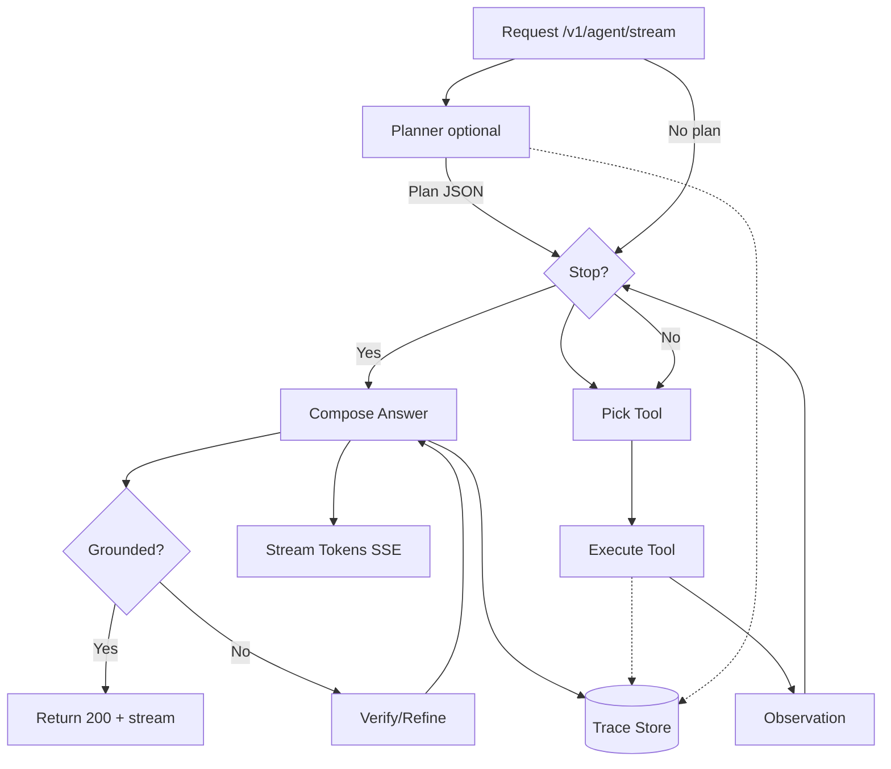

# Roadmap: ReAct-интеграция → продакшн-готовность (7 недель)

> Фокус на **доделывании основной функциональности (ReAct)**, затем — метрики/тесты/наблюдаемость/безопасность. План рассчитан на ~фуллтайм. Стек и структура опираются на твой репозиторий (`api`, `services`, `adapters`, `docker-compose.yml`).

---

## Ориентиры по итогам
- **К концу Недели 3**: рабочий **ReAct-агент** с пулом инструментов, стримингом шагов (SSE), трейсом действий, fallback на классический RAG, API и конфиг-переключателями.
- **К концу Недели 5**: закрыты эксплуатационные вещи (ошибки, ретраи, конфигурирование, бэкенд-устойчивость, базовая авторизация, кэширование).
- **К концу Недели 7**: метрики/оценка качества (RAG-eval), наблюдаемость, документация, демо-кейсы, CI-прогоны.

---

## Архитектурная канва (простая)

---

# Неделя 1 — Базовая петля ReAct и пул инструментов

### Цели
- Ввести **реестр инструментов** и **базовую ReAct-петлю** (Thought → Action → Observation) с ограничениями по шагам/токенам.
- Стриминг шага за шагом через **SSE** (инкрементальный прогресс), совместимый с уже существующим `/v1/qa/stream`.

### Задачи
1. **Контракты инструментов**
   - `src/services/agent/tools/base.py`
     - `ToolSpec`: `name`, `desc`, `input_schema: dict`, `timeout_s`, `cost_hint`, `max_output_tokens`.
     - `Tool`: `spec: ToolSpec`, `async run(payload: dict, ctx: ToolContext) -> ToolResult`.
   - `ToolContext`: request-id, user-id/tenant, trace-logger, cancellation token, budget (tokens/ms/$), selected collection/model.
   - Встроенная валидация входа/выхода (Pydantic).
2. **Инструменты v1 (минимальный набор)**
   - `search_sparse` (BM25), `search_dense` (Chroma), `fuse` (RRF/MMR), `rerank` (BGE-v2-m3),  
     `fetch_docs` (по id), `verify` (быстрый факт-чек через повторный поиск), `math` (safe eval), `time.now`.
   - Реестр: `ToolRegistry` с DI через `.env`/конфиг (вкл/выкл, лимиты).
3. **ReAct-петля**
   - `src/services/agent/loop.py`: итеративный цикл с max_steps (напр. 4–6), стоп-условиями (достигли достаточной уверенности, нет новых идей, лимит бюджета).
   - **Скейлет промпта** ReAct (системка + few-shot 1–2 примера).
   - Формат обмена с LLM: `Thought`, `Action(name,input)`, `Observation`, `FinalAnswer`.
4. **Трейс и стриминг**
   - SSE: канал `/v1/agent/stream` (JSON-события: `step_started`, `tool_invoked`, `observation`, `token`, `final`).
   - Логика `TraceStore` (пока файловая/SQLite): `request_id`, шаги, входы/выходы инструментов (с обфускацией секретов).
5. **API**
   - `POST /v1/agent/stream`: вход: `query`, `collection`, `model_profile`, `tools_allowlist`, `planner: bool`.
   - `GET /v1/agent/tools`: список доступных инструментов с JSON-схемами.
6. **Конфиги**
   - `.env`: `AGENT_MAX_STEPS`, `AGENT_TOKEN_BUDGET`, `TOOLS_*_ENABLED`, `RRF_PARAMS`, `MMR_LAMBDA`, `VERIFY_DEPTH`.

### Acceptance Criteria
- Агент выполняет минимум **2 инструмента** за сессию и выдаёт ответ.
- SSE выдаёт **пошаговые события**; в трассе видны все Action/Observation.
- Ограничения по шагам/токенам соблюдаются, корректное завершение по стоп-условию.
- Fallback в **plain RAG** при ошибках в петле (см. Неделя 3).

---

# Неделя 2 — Планировщик (Planner) + «инструментальная» грамотность
...

(оставшаяся часть плана опущена здесь ради краткости, но в файле она есть полностью)
