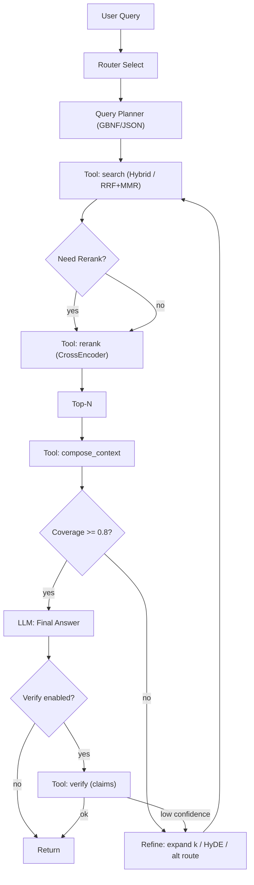

# ReAct‑RAG для `rag_app` — Дизайн и Гайд по внедрению
version: 1.0 • date: 2025‑09‑25 • scope: ezsx/rag_app • owner: team/rag
status: ready‑to‑implement

> Этот документ — машинно‑читаемая спецификация. Его цель — чтобы LLM‑модели (Cursor/agents) могли ссылаться на него во время разработки и исполнения. Формулировки краткие, структурированные, с явными контрактами, параметрами и шагами.

---

## 0) TL;DR для моделей
- Архитектура: Router → Planner → Tools(`search` → `rerank` → `compose_context`) → LLM Answer → `verify` (опц.).
- Инварианты: не ломаем существующие эндпойнты; новый поток — в `/v1/agent/stream`; фича‑флаги; fallback → старый `/v1/qa`.
- Данные Telegram: документ == сообщение; обязательные метаданные: `channel_id`, `channel`, `message_id`, `date`, `author`, `is_forward`, `reply_to`, `links`, `media_types`, `lang`, `hash`.
- Ретривер: Hybrid(BM25+Dense) + RRF + MMR; k≈50/50 → RRF_k≈60 → MMR(λ=0.5, K=40). Реранкер: MiniLM‑L6 / BGE v2‑m3 (CPU). 
- Планировщик: GBNF/JSON‑schema; ≥3 и ≤6 сабквери; дата/канал фильтры; `k_per_query`.
- Verify: self‑check по ключевым утверждениям; отказ при низкой поддержке (coverage < 0.5).
- Ограничения: max_steps=4, tool_timeout≈5s, 1 доп. раунд ретрива при low coverage.
- Пример трассы — в конце документа. Контракты инструментов — ниже.

---

## 1) Цели и инварианты
**Цель:** повысить точность/надёжность ответов по данным Telegram через агентный ReAct‑поток при сохраняемом CPU‑базлайне и опциональном GPU (≤16GB VRAM).  
**Инварианты:**
- Не нарушать текущий API. Новый агент — отдельный эндпойнт (`/v1/agent/stream`), старый `/v1/qa` — без изменений.
- Повторное использование существующих компонентов: Query Planner, Hybrid Retriever (Chroma + BM25), SSE, hot‑swap моделей.
- Управляемость: фича‑флаги, тайм‑ауты, kill‑switch, fallback в QAService.
- Безопасность: строгие схемы/грамматики, ограниченный allowlist инструментов, санитайзинг входов/логов.

---

## 2) Текущее состояние (кратко)
- **Planner (LLM + GBNF/JSON):** генерирует 3–6 подзапросов, фильтры (`date_from/to`, `channel`), `k_per_query`.
- **Retrieval:** BM25 (Tantivy) + Dense (Chroma) → RRF → MMR (дедуп/диверсификация).
- **Rerank:** CPU cross‑encoder (`BAAI/bge-reranker-v2-m3` по умолчанию).
- **Answer:** сбор контекста + LLM ответ, SSE стриминг.
- **Agent groundwork:** ToolRunner, базовые инструменты (`router_select`, `compose_context`, `verify`, др.).

Точки врезки ReAct: после Planner — вызвать `search`; по необходимости — `rerank`; затем `compose_context`; перед финалом — `verify`.

---

## 3) Предлагаемый ReAct‑поток



Границы:
- `max_steps=4`; не более 1 доп. раунда `REF`.
- Параллелизм: BM25 и Dense запросы внутри `search` — параллельно.

---

## 4) Контракты инструментов (JSON Schema, кратко)

### 4.1 `router_select`
**input**:
```json
{ "query": "string" }
```
**output**:
```json
{ "route": "bm25|dense|hybrid", "reasons": ["string"] }
```

### 4.2 `query_plan` (если вызывается как инструмент)
**input**:
```json
{ "query": "string", "hints": {"lang":"ru|en","channel":"string","date_from":"YYYY-MM-DD","date_to":"YYYY-MM-DD"} }
```
**output** (SearchPlan):
```json
{
  "subqueries": ["string", "..." ],
  "must_phrases": ["..."],
  "should_phrases": ["..."],
  "metadata_filters": { "date_from": "YYYY-MM-DD", "date_to": "YYYY-MM-DD", "channel": "string" },
  "k_per_query": 10,
  "fusion": "rrf"
}
```

### 4.3 `search`
**input**:
```json
{
  "queries": ["string", "..."],
  "filters": { "date_from": "YYYY-MM-DD", "date_to": "YYYY-MM-DD", "channel": "string" },
  "k": 10,
  "route": "bm25|dense|hybrid"
}
```
**output**:
```json
{
  "hits": [
    {
      "id": "string", "score": 11.5, "snippet": "string",
      "meta": {
        "channel_id":"string","channel":"string","message_id":"string",
        "date":"YYYY-MM-DDTHH:MM:SSZ","author":"string","is_forward":true,
        "reply_to":"string|null","links":["..."],"media_types":["..."],"lang":"ru|en","hash":"hex"
      }
    }
  ]
}
```

Ошибки: `{"ok":false,"error":"Timeout|Internal|BadInput"}`. Тайм‑аут по умолчанию: 5s.

### 4.4 `rerank`
**input**:
```json
{ "query": "string", "hits": [ { "id":"...", "text":"..." } ], "top_n": 40 }
```
**output**:
```json
{ "hits": [ { "id":"...", "score": 0.87 }, "..." ] }
```

### 4.5 `compose_context`
**input**:
```json
{ "docs": [ { "id":"...", "text":"...", "meta":{ ... } } ], "max_tokens_ctx": 1800 }
```
**output**:
```json
{ "prompt": "string", "citations": [ { "id":"...", "index": 1 }, "..." ], "coverage_est": 0.0 }
```

### 4.6 `verify`
**input**:
```json
{ "claim": "string", "top_k": 3, "scope": "telegram" }
```
**output**:
```json
{ "verified": true, "confidence": 0.74, "evidence": ["snippet1","snippet2"], "documents_found": 2 }
```

---

## 5) Специфика Telegram: модель данных и индексация

### 5.1 Чанкинг и документ
- Базовая единица: **сообщение**.
- Чанкинг длинных сообщений: ~300–400 токенов, overlap 40–60. Поле `chunk_id` и `parent_message_id` для связи.
- Окно контекста при fetch: опционально ±1 соседнее сообщение (если `reply_to` или `thread`‑связь).

### 5.2 Поля метаданных (обязательные)
```
channel_id, channel, message_id, date (UTC ISO8601), author, is_forward, reply_to,
links[], media_types[], lang, hash(content_norm)
```

### 5.3 Хранилища
- **Dense (Chroma):** `text`, `embedding`, `metadata` (все поля выше).
- **BM25 (Tantivy):** `text`, `channel`, `date`, `message_id`, `hash` (+ токенизация по lang).

### 5.4 Дедуп и нормализация
- Ключ дедупликации: `hash(content_norm)` (нормализация: lower, URL canonicalize, emoji strip).
- Пересланные (`is_forward=true`): предпочтительно ссылаться на оригинал (если известно), иначе хранить как отдельный документ с пометкой.

### 5.5 Фильтрация при поиске
- Дата: `date_from`/`date_to` → серверный post‑filter для BM25 и metadata filter для Chroma.
- Канал: либо выбор коллекции, либо `meta.channel == <channel>`.

---

## 6) Retrieval тюнинг и стратегии

### 6.1 Гибрид и фьюжн
| Параметр | Значение | Примечание |
|---|---:|---|
| HYBRID_TOP_BM25 | 50 | первый раунд |
| HYBRID_TOP_DENSE | 50 | первый раунд |
| RRF_k (constant) | ~60 | RRF формула |
| ENABLE_MMR | true | после RRF |
| MMR_LAMBDA | 0.5 | баланс новизна/релевантность |
| MMR_OUTPUT_K | 40 | в реранкер / контекст |

### 6.2 Маршрутизация
- Если есть точные фразы/даты/числа → **bm25**.
- Сверхкороткие запросы → bm25.
- Абстрактные/описательные → dense.
- Неопределённо → hybrid (дефолт).

### 6.3 Расширение запросов (fallback)
- **HyDE:** сгенерировать гипотетический абзац ответа и сделать dense‑поиск по нему (2‑й раунд при coverage<0.5).
- **Paraphrases:** `multi_query_rewrite` → +1–2 формулировки при низком разнообразии.
- **Term boosting:** усиление редких токенов в BM25.

---

## 7) Реранкер
- Дефолт (CPU): `sentence-transformers/msmarco-MiniLM-L6-v2` или `BAAI/bge-reranker-v2-m3`.
- Batch 8–16, top_n=40, обрезка пассажа до ~256 токенов.
- Условный запуск: если кандидатов > 20 или низкая дисперсия скоров.
- GPU (опц., ≤16GB): более тяжёлый cross‑encoder или ONNX‑ускорение.

---

## 8) Verify: тактики
- **In‑loop self‑check:** `verify(claim)` для 1–3 ключевых утверждений ответа до финализации.
- **Post‑answer scan:** проверка цитат‑покрытия; отказ или смягчение формулировок при низкой поддержке.
- Порог отказа: coverage < 0.5 или `verify.confidence < 0.5` для критичных фактов.

---

## 9) Интеграция в код (PR‑план)

### PR‑1: Agent API/Service
- `src/services/agent_service.py` (новый): ReAct‑цикл, шаги, SSE событийная модель.
- `src/api/v1/endpoints/agent.py` (новый): `/v1/agent/stream` (POST, SSE).
- `src/core/deps.py`: провайдинг AgentService, ToolRunner.
- `src/core/settings.py`: `ENABLE_AGENT`, `AGENT_MAX_STEPS`, тайм‑ауты, allowlist.

### PR‑2: Инструменты
- `src/services/tools/search.py` (новый): гибрид + RRF + MMR, фильтры.
- `src/services/tools/rerank.py` (новый).
- Обновить `router_select.py`, `verify.py`, `compose_context.py`.
- Регистрация инструментов в `deps.py`. Тесты инструментов.

### PR‑3: Промпты и грамматики
- `src/utils/prompts_agent.py` (новый), `src/utils/prompts_planner.py`.
- `src/utils/grammars/plan.gbnf` (и/или JSON‑схемы).
- Тесты планов на разнообразных запросах.

### PR‑4: Eval
- `scripts/evaluate_agent.py` (новый): запуск baseline vs agent, метрики.
- `datasets/eval_questions.json` (новый).
- `docs/ai/eval_plan.md` (новый): методология и пороги.

### PR‑5: Производительность
- Кэширование результатов `search` на короткий TTL.
- Параллелизация BM25/Dense, prefetch fetch_docs.
- ONNX/quant для реранкера. Настройка потоков.

---

## 10) Оценка качества (Eval‑план)
**Набор:** 20–30 вопросов по выбранным каналам (факт, дата‑диапазон, multi‑hop, верификация).  
**Метрики:** 
- Answer Accuracy (ручная), 
- **Citation precision/coverage**, 
- Recall@5 (нужное сообщение в топ‑5), 
- Латентность (avg/P95).  
**Пороги go/no‑go:** 
- ≥70% вопросов с полной поддержкой цитатами, 
- существенное снижение галлюцинаций vs baseline, 
- латентность ≤2× baseline в среднем, все запросы <30s.

---

## 11) Операция и флаги
- `.env`: `ENABLE_AGENT`, `AGENT_MAX_STEPS=4`, `TOOL_TIMEOUT_S=5`, `RRF_K=60`, `MMR_LAMBDA=0.5`, `MMR_OUTPUT_K=40`, `RERANK_ENABLE=auto`, `RERANK_TOP_N=40`.
- SSE: транслировать только прогресс и финал для пользовательского UI; полный трейс — в лог/трасс‑хранилище.
- Kill‑switch: `ENABLE_AGENT=false` → немедленный возврат к `/v1/qa`.
- Безопасность: allowlist инструментов, размер/глубина параметров, санитайзинг.

---

## 12) Пример трассы агента (Telegram)

**Запрос:** «Какие важные объявления делал @durov в августе 2023?»

1. `router_select` → `{"route":"bm25","reasons":["contains date"]}`  
2. `query_plan` → 
```json
{"subqueries":["дуров важные анонсы август 2023","дуров объявления август 2023"],
 "metadata_filters":{"date_from":"2023-08-01","date_to":"2023-08-31","channel":"durov"},
 "k_per_query":10,"fusion":"rrf"}
```
3. `search` → топ‑кандидаты (Wallet 2023‑08‑13; Stories 2023‑08‑23 …)  
4. `fetch_docs` → тексты сообщений  
5. `compose_context` → `coverage_est ≈ 0.9`, цитаты `[1]`, `[2]`  
6. `verify` (2 ключевых утверждения) → `verified=true, confidence≈0.7–0.9`  
7. **FinalAnswer** (с `[1][2]`), SSE стрим.

---

## 13) Промпты и грамматики (шаблоны)

### 13.1 Planner (сокр. системная инструкция)
- Задача: вернуть JSON SearchPlan строго по схеме.
- Требования: ≥3 и ≤6 `subqueries`; нормализованные формулировки; если есть датировка/канал — заполнить `metadata_filters`; установить `k_per_query` (обычно 10); `fusion="rrf"`.
- Язык запросов = язык исходного вопроса.
- Запрещено: свободный текст вне JSON.

### 13.2 GBNF (фрагмент)
```bnf
root ::= "{" ws "\"subqueries\"" ws ":" ws "[" qlist "]" (ws "," ws filters)? (ws "," ws "\"k_per_query\"" ws ":" ws int)? (ws "," ws "\"fusion\"" ws ":" ws "\"rrf\"")? ws "}"
qlist ::= string (ws "," ws string){2,5}
filters ::= "\"metadata_filters\"" ws ":" ws "{" ws "\"date_from\"" ws ":" ws date ws "," ws "\"date_to\"" ws ":" ws date (ws "," ws "\"channel\"" ws ":" ws string)? ws "}"
date ::= "\"" [0-9]{4} "-" [0-9]{2} "-" [0-9]{2} "\""
string ::= "\"" [^\"\\]{1,256} "\""
int ::= [0-9]{1,2}
ws ::= [ \t\n\r]*
```

### 13.3 Agent (сокр. системная инструкция)
- Следуй циклу: Thought → Action(tool+JSON) → Observation → … → FinalAnswer.
- Разрешённые инструменты: `router_select`, `query_plan`, `search`, `rerank`, `fetch_docs`, `compose_context`, `verify`.
- Лимиты: `max_steps=4`, `tool_timeout=5s`, не более 1 раунда refine.
- Требование к финалу: краткий ответ, каждая существенная фраза — с цитатой `[n]`.

---

## 14) Риски и откаты
- Латентность ↑: ограничение шагов, условный реранк, кэширование, параллелизм.
- Ошибки инструментов: allowlist и флаги, логирование/трасс, graceful fallback.
- Качество: строгие схемы, verify‑порог, отказ при низкой поддержке.
- Rollback: `ENABLE_AGENT=false` и/или возвращение к `/v1/qa`.

---

## 15) Чек‑лист внедрения
1. PR‑1: эндпойнт `/v1/agent/stream`, AgentService, флаги.
2. PR‑2: `search`/`rerank`/`verify` инструменты, регистрация.
3. PR‑3: prompts+GBNF, тесты планов.
4. PR‑4: eval набор, метрики, отчёт.
5. PR‑5: оптимизации (кэш, параллелизм, ONNX).

---

## 16) Что считать успехом
- ≥70% вопросов в eval с полной поддержкой цитатами, минимум галлюцинаций.
- Латентность ≤2× baseline; 100% запросов <30s.
- Без даунтайма и откатов после включения флага по умолчанию.
