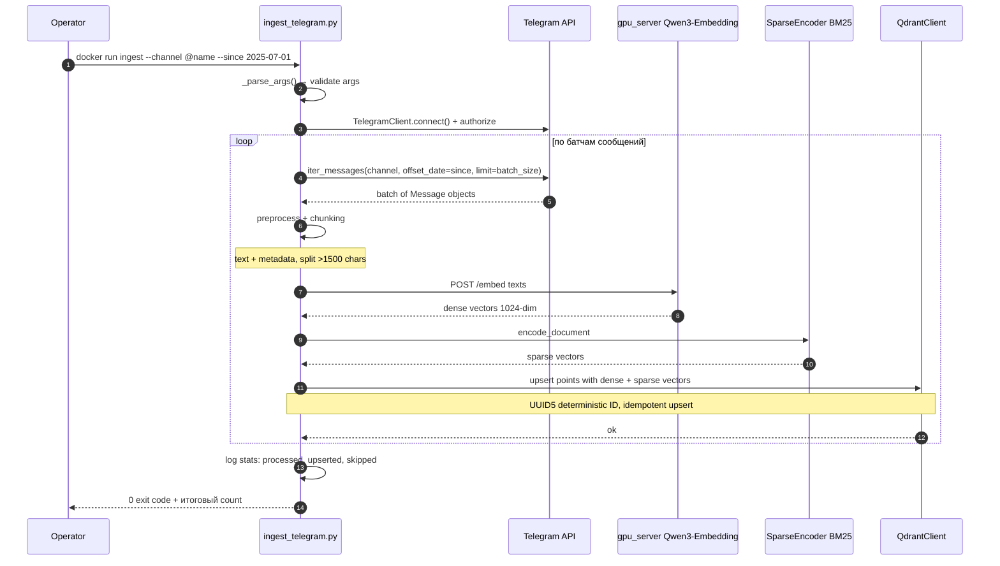

## FLOW-01: Telegram Ingest

### Problem
Сообщения из Telegram-каналов должны быть проиндексированы для последующего поиска.
Инжест должен быть идемпотентным (повторный запуск не дублирует данные).

### Contract
```
docker compose -f deploy/compose/compose.dev.yml run --rm ingest \
  --channel @channel_name [--since YYYY-MM-DD] [--until YYYY-MM-DD] [--collection collection_name]
```

### Actors
- **Operator** — человек запускает ingest CLI
- **TelegramClient** — Telethon HTTP клиент к Telegram API
- **TEIEmbeddingClient** — HTTP клиент к gpu_server.py (Qwen3-Embedding-0.6B, RTX 5060 Ti)
- **SparseEncoder** — `Qdrant/bm25` с `language="russian"` (Snowball stemmer)
- **QdrantClient** — вектор-база с named vectors (dense + sparse + ColBERT)

### Sequence



### Ключевые инварианты

- Document ID формат: UUID5 от `{channel_name}:{message_id}` — стабильный, позволяет upsert
- Embedding: Qwen3-Embedding-0.6B через gpu_server.py HTTP (не SentenceTransformer)
- Sparse encoder: `Qdrant/bm25` с `language="russian"` (Snowball) — **не BM42** (English-only)
- Chunking: posts <1500 chars целиком, >1500 recursive split (target 1200 chars)
- Qdrant storage: **только named volume** `qdrant_data` (INV-06, DEC-0015)
- Коллекция Qdrant: named vectors `dense_vector` (cosine, 1024-dim) + `sparse_vector`
- ColBERT vectors индексируются отдельно (offline batch через gpu_server.py `/colbert-encode`)

### Техдолг

- ColBERT vectors не встроены в основной ingest — добавляются отдельным offline скриптом
- Нет инкрементального обновления (live-инgest) — только batch по диапазону дат
- Нет мониторинга прогресса через SSE/webhook (только stdout)
