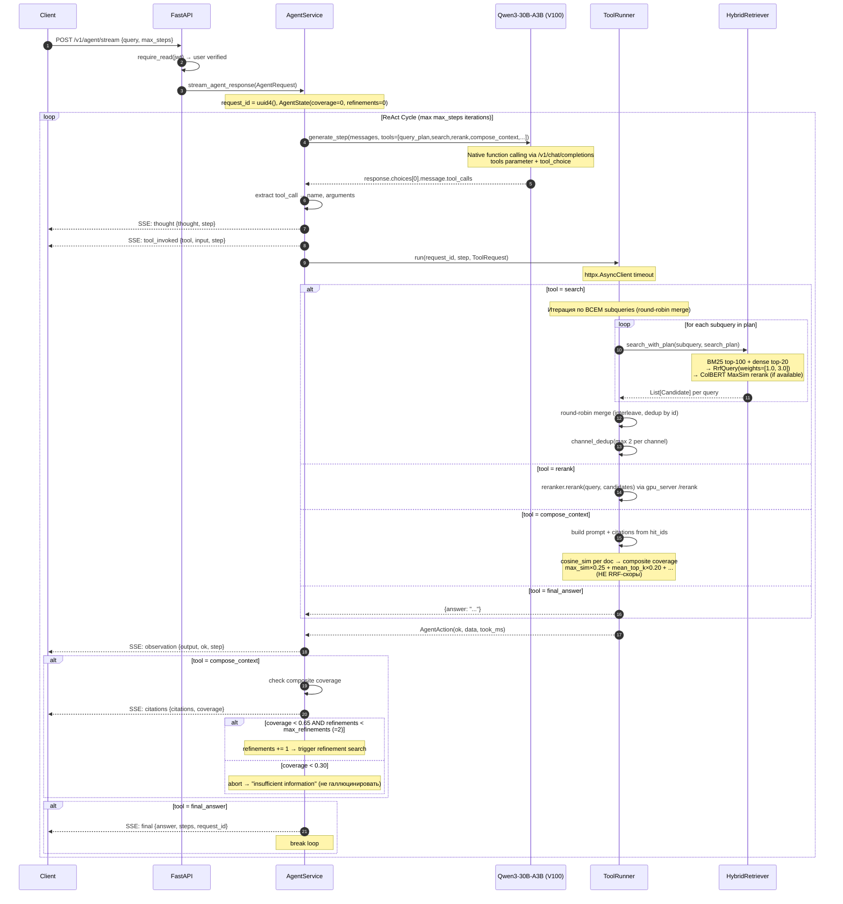

## FLOW-02: Agent Request → SSE Stream

### Problem
Пользователь задаёт вопрос. Агент должен найти релевантные данные в Telegram-архиве
и дать ответ с цитатами. Весь процесс транслируется через SSE для наблюдаемости.

### Contract
```
POST /v1/agent/stream
Authorization: Bearer <jwt>
Content-Type: application/json

{"query": "string", "max_steps": 8, "planner": true}

→ text/event-stream
  event: thought       {"thought": "...", "step": N, "request_id": "..."}
  event: tool_invoked  {"tool": "...", "input": {...}, "step": N, "request_id": "..."}
  event: observation   {"tool": "...", "output": {...}, "ok": bool, "step": N}
  event: citations     {"citations": [...], "coverage": float, "step": N}
  event: final         {"answer": "...", "step": N, "total_steps": N, "request_id": "..."}
```

### Actors
- **Client** — browser (Web UI) / evaluate_agent.py
- **FastAPI** — HTTP layer, SSE stream
- **AgentService** — ReAct loop owner, native function calling
- **ToolRunner** — tool registry + timeout execution
- **LLM** — Qwen3-30B-A3B GGUF (llama-server, V100; `--jinja --reasoning-budget 0`)
- **HybridRetriever** — Qdrant: BM25+Dense → weighted RRF 3:1 → ColBERT MaxSim → channel dedup
- **RerankerService** — bge-reranker-v2-m3 cross-encoder (GPU, RTX 5060 Ti)
- **QueryPlannerService** — тот же LLM endpoint (не отдельный CPU процесс)

### Sequence



### Dynamic Tool Visibility

- `final_answer` **скрыт** до выполнения `search` — LLM не может пропустить поиск
- Если LLM не вызывает tools → **forced search** с оригинальным запросом пользователя
- Оригинальный запрос **всегда** добавляется в subqueries (BM25 keyword match)

### Multi-Query Search Detail

```
query_plan → subqueries: ["query A", "query B", "query C"]
  + original user query (всегда добавляется)

for each subquery:
  → search_with_plan(subquery, plan)
    → Qdrant: BM25 top-100 + dense top-20 → weighted RRF (3:1)
    → ColBERT MaxSim rerank (top candidates)
  → append to per_query_results[]

Round-robin merge:
  for rank 0..max_len:
    for each per_query_results:
      if not seen → append to all_candidates

Channel dedup: max 2 docs from same channel → diversity
```

### Coverage Check Detail

```
compose_context(hit_ids, query) → composite_coverage (float 0-1)
  │
  ├── coverage >= 0.65  →  proceed to final_answer
  ├── coverage < 0.65 AND refinements < 2
  │     └── refinements += 1 → ещё один search + compose_context
  ├── coverage < 0.65 AND refinements >= 2
  │     └── proceed anyway (best effort)
  └── coverage < 0.30
        └── abort: вернуть "insufficient information" (не галлюцинировать)

Composite formula (compute в compose_context, НЕ в AgentService):
  scores = [doc.cosine_sim for doc in retrieved_docs]  # из Qdrant with_vectors=True
  max_sim           × 0.25
  mean_top_k        × 0.20
  term_coverage     × 0.20   # доля ключевых слов query в тексте документов
  doc_count_adequacy× 0.15   # docs с cosine > 0.55 / target_k
  score_gap         × 0.15   # 1 - (top1-topk) / top1
  above_threshold   × 0.05
```

### Ключевые инварианты

- RULE 4 (system prompt): FinalAnswer запрещён без предшествующего compose_context
- `AgentState` живёт ровно столько, сколько один запрос
- При отключении клиента (`is_disconnected()`) — loop прерывается
- Все tool timeout через `ToolRunner._run_with_timeout()`
- `compose_context` получает `query` как параметр (необходим для term_coverage)
- `verify` и `fetch_docs` — системные вызовы внутри AgentService, не LLM tools

### Техдолг

- `AgentService._current_step` и `_current_request_id` — shared class attributes
  вместо per-request local → `contextvars.ContextVar` (OPEN-01, R06)
