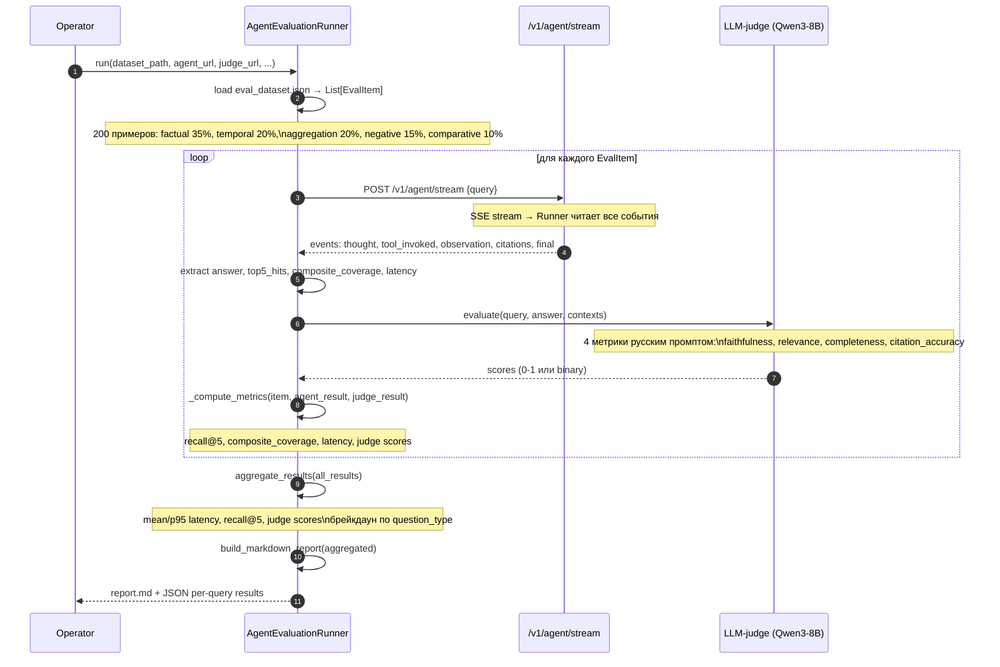

## FLOW-03: Evaluation Run

### Problem
Необходимо количественно измерить качество агента: recall, composite coverage, latency,
и семантическое качество ответов (faithfulness, relevancy, hallucination).
Evaluation должна быть воспроизводимой и сравнимой между версиями.

### Contract
```
python scripts/evaluate_agent.py \
  --dataset datasets/eval_dataset.json \
  --agent-url http://localhost:8000 \
  --api-key $ADMIN_KEY \
  [--dry-run] [--max-steps 8] [--judge-url http://host.docker.internal:8080/v1]

→ stdout: progress + JSON metrics per query
→ docs/eval-reports/YYYY-MM-DD-HH-MM.md: Markdown отчёт
```

### Actors
- **Operator** — запускает скрипт (или CI)
- **EvalRunner** — `AgentEvaluationRunner` в evaluate_agent.py
- **AgentAPI** — запущенный `/v1/agent/stream` endpoint
- **LLMJudge** — Qwen3-8B через llama-server (тот же endpoint), русскоязычные промпты
- **DeepEval** — CI/CD runner для метрик (BaseMetric wrapper)

### Sequence



### Метрики (Phase 1 — retrieval + coverage)

| Метрика | Описание |
|---------|---------|
| `recall@5` | Доля expected_documents в топ-5 hits агента |
| `full_recall` | Все expected_documents найдены |
| `partial_recall` | Хотя бы один found |
| `agent_latency_sec` | Время от запроса до final события |
| `composite_coverage` | Взвешенная сумма 5 сигналов из compose_context (0–1) |
| `agent_steps` | Количество шагов ReAct цикла |

### Метрики (Phase 2 — LLM-judge, DEC-0020)

| Метрика | Промпт (RU) | Формат |
|---------|------------|--------|
| `faithfulness` | «Все ли утверждения подтверждаются источниками?» | binary 0/1 |
| `answer_relevancy` | «Отвечает ли ответ именно на заданный вопрос?» | 0–1 |
| `completeness` | «Использованы ли все релевантные факты из источников?» | 0–1 |
| `citation_accuracy` | «Соответствуют ли цитаты содержимому документов?» | binary 0/1 |

**Реализация**: custom промпты → DeepEval `BaseMetric`. RAGAS — только для разовых reference-аудитов (нестабилен, EN-only промпты, NaN на vLLM).

### Датасет (OPEN-06)

- **Файл**: `datasets/eval_dataset.json` — текущий содержит 2 фейковых примера
- **Генератор**: `scripts/generate_eval_dataset.py` (Phase 1, требует Qdrant):
  - 400 точек из Qdrant → Qwen3-8B генерирует вопросы → critique-фильтр → ~200 финальных
  - Принудительное распределение типов (иначе 95% factual → завышенные метрики)
- **Минимальный размер**: 200 примеров (margin of error ±5.5% при 95% CI)

### Техдолг

- Phase 2 (LLM-judge / DeepEval) не реализована — только Phase 1 retrieval метрики
- `eval_dataset.json` содержит 2 фейковых примера с несуществующими Qdrant IDs
- `generate_eval_dataset.py` спроектирован (R05), ждёт задеплоенного Qdrant (Phase 1)
