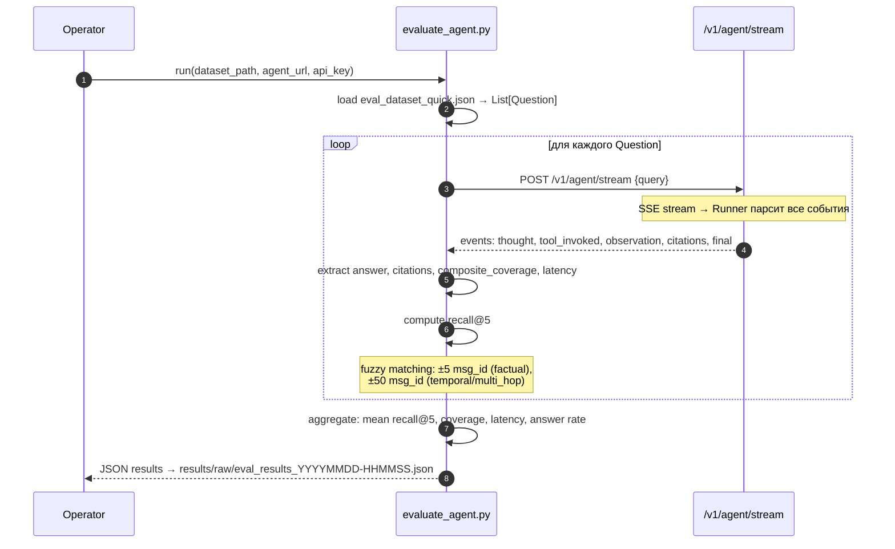
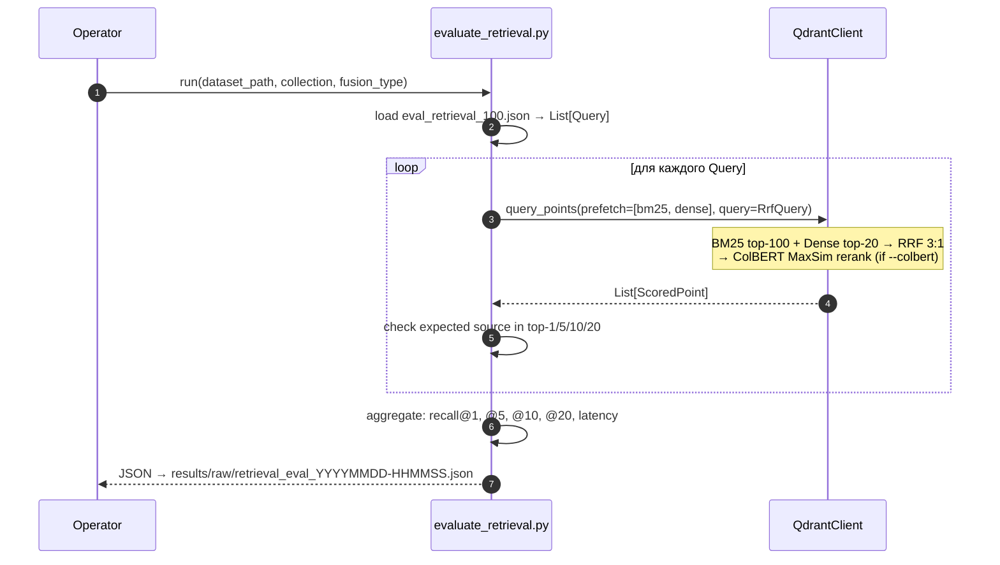

## FLOW-03: Evaluation Run

### Problem
Необходимо количественно измерить качество агента и retrieval pipeline: recall, coverage, latency.
Evaluation должна быть воспроизводимой и сравнимой между версиями.

### Два режима evaluation

**1. Agent Eval** — полный pipeline через LLM (~40с/запрос):
```
python scripts/evaluate_agent.py \
  --dataset datasets/eval_dataset_quick.json \
  --agent-url http://localhost:8001 \
  --api-key $ADMIN_KEY
```

**2. Retrieval Eval** — прямые Qdrant queries, без LLM (~5с/запрос):
```
python scripts/evaluate_retrieval.py \
  --dataset datasets/eval_retrieval_100.json \
  --collection news_colbert
```

### Agent Eval Sequence



### Retrieval Eval Sequence



### Метрики

| Метрика | Agent Eval | Retrieval Eval | Описание |
|---------|-----------|----------------|---------|
| `recall@1` | — | ✅ | Expected doc в топ-1 |
| `recall@5` | ✅ | ✅ | Expected docs в топ-5 hits |
| `recall@10` | — | ✅ | Expected doc в топ-10 |
| `recall@20` | — | ✅ | Expected doc в топ-20 |
| `composite_coverage` | ✅ | — | Взвешенная сумма 6 cosine-сигналов (0–1) |
| `agent_latency_sec` | ✅ | — | Время от запроса до final события |
| `retrieval_latency` | — | ✅ | Время одного Qdrant query |
| `answer_rate` | ✅ | — | Доля запросов с непустым ответом |

### Текущие результаты (2026-03-20)

| Dataset | Recall@5 | Coverage | Тип |
|---------|----------|----------|-----|
| v1 (10 Qs) | **0.76** | 0.86 | Agent eval |
| v2 (10 Qs, сложные) | **0.61** | 0.80 | Agent eval |
| 100 Qs, RRF+ColBERT | **0.73** | — | Retrieval eval |

22 эксперимента отслежены в `docs/planning/retrieval_improvement_playbook.md`.

### Датасеты

| Файл | Тип | Вопросов | Описание |
|------|-----|----------|----------|
| `eval_dataset_quick.json` | Agent eval | 10 | factual, temporal, channel, comparative, multi_hop, negative |
| `eval_dataset_quick_v2.json` | Agent eval | 10 | entity, product, fact_check, cross_channel, recency, numeric, long_tail, negative |
| `eval_retrieval_100.json` | Retrieval eval | 100 | Auto-generated из первых предложений документов, 35 каналов |

### Техдолг

- LLM-judge (faithfulness, relevance) не реализован — только retrieval метрики
- Dataset < 50 вопросов — недостаточно для статистической значимости
- Нет автоматического regression testing в CI
